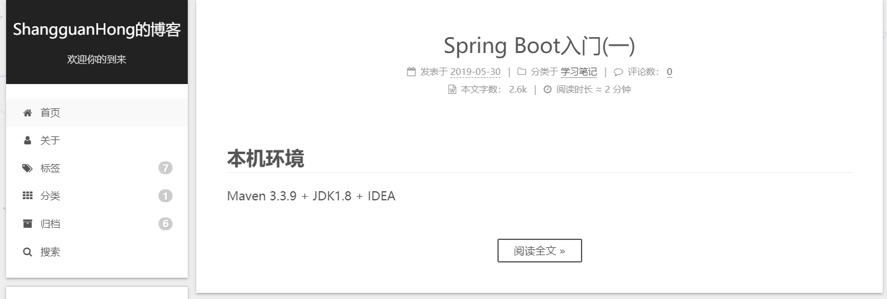

1. 修改 `站点配置文件_config.yml` 里的 `post_asset_folder: false` 为 `post_asset_folder: true` 

2. 当设置了 `post_asset_folder` 为 `true` 后，用 `hexo new "new page"` 生成新的博客时，Hexo会自动建立一个同名的文件夹，当文章用到了资源时，只需要将该资源放入此文件夹即可

   **注意:最好使用 `hexo new "new page"` 来自动生成相应的文章和文件夹，避免不必要的问题。**

   <!--more-->

3. 到站点根目录下执行 `npm install hexo-asset-image --save` 来安装图片资源插件

4. 需要用到图片的时候只需要 `` 即可

5. 测试是否成功。运行 `hexo s` ，本地博客出现图片即代表成功，这时便可运行 `hexo d -g` 推送到远程博客。下面放一张图片用来测试

