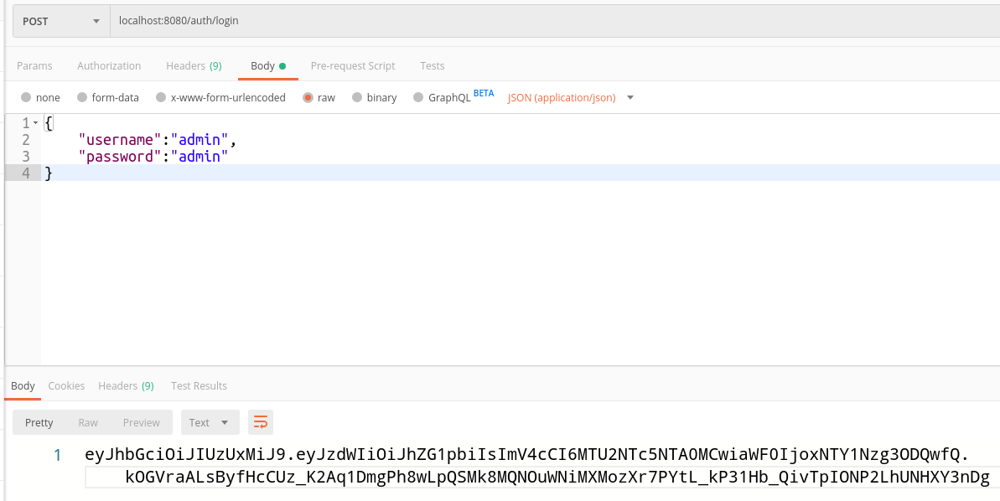
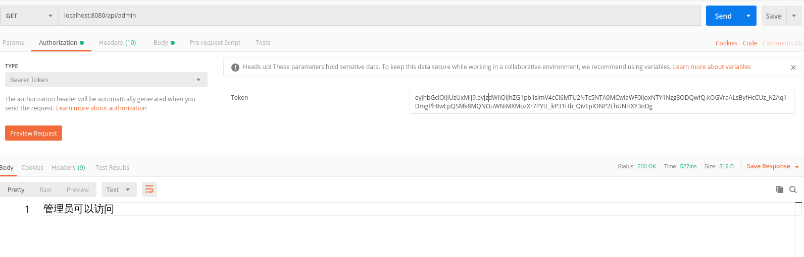
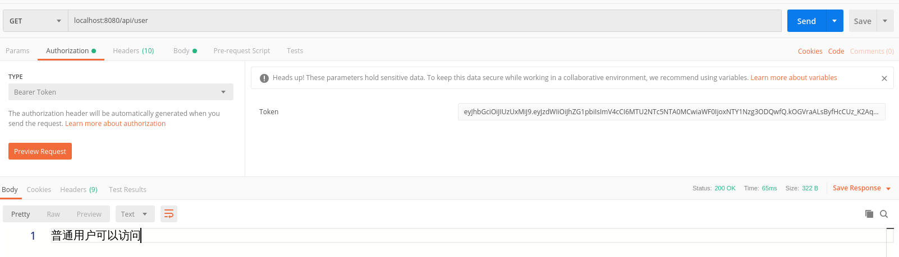
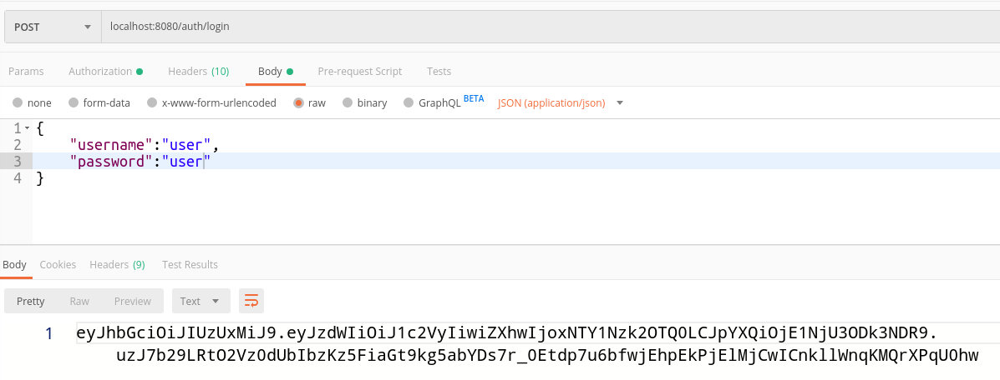
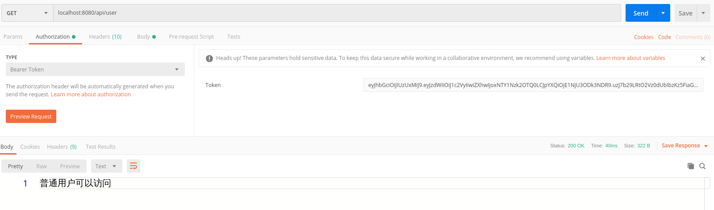
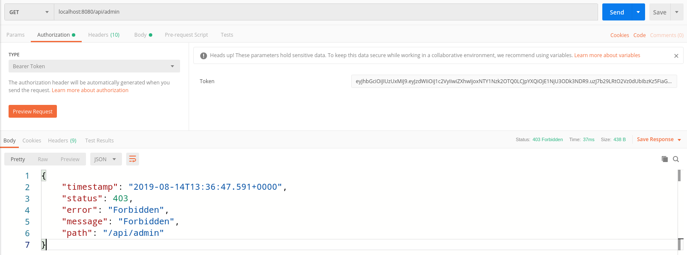

# 1. 前言

之前介绍了一下 [JWT](https://shangguanhong.github.io/2019/08/08/了解JSON-Web-Token-JWT/) ,在最后提到了 

> JWT 本身没啥难度，但安全整体是一个比较复杂的事情，JWT 只不过提供了一种基于 token 的请求验证机制。但我们的用户权限，对于 API 的权限划分、资源的权限划分，用户的验证等等都不是 JWT 负责的。也就是说，请求验证后，你是否有权限看对应的内容是由你的用户角色决定的。所以我们这里要利用 Spring 的一个子项目 Spring Security 来简化我们的工作。

本文就介绍一下如何利用 Spring Security 来配合 JWT 来使用。

# 2. Spring Security的介绍

Spring Security 是一个基于 Spring 的通用安全框架，里面内容太多了，本文的主要目的也不是展开讲这个框架，而是如何利用 Spring Security 和 JWT 一起来完成 API 保护。所以关于 Spring Secruity 的基础内容或展开内容，请自行去 [官网](http://projects.spring.io/spring-security/ ) 学习。

<!--more-->

# 3. 使用Spring Security

## 3.1 表结构

首先使用 Spring Security 的系统需要有用户与角色的概念，一个用户可以拥有多个角色，一个角色可以分配给多个用户，因此用户和角色之间是多对多的关系，利用一个中间表来维护它们之间的关系。

sys_user:

id | username | password| lastPasswordResetDate | enabled 
:-: |  :-: | :-:|:-: |:-: 
1 | admin | admin| null | 1 
2 | user | user| null | 1 

sys_role:

id | role_name
:-: |  :-:
1 | ADMIN
2 | USER

sys_user_role：

u_id | r_id
:-: |  :-:
1 | 1
1 | 2
2 | 2

>管理员拥有用户和管理员两种角色，而用户仅仅拥有用户的角色

jpa 表示如下：

User:

```java
@Entity
@Data
@Table(name = "sys_user")
@EqualsAndHashCode(exclude = {"roles"})
public class User {

    @Id
    @GeneratedValue(strategy = GenerationType.IDENTITY)
    @Column(name = "id")
    private Long id;

    @Column(name = "username")
    private String username;

    @Column(name = "password")
    private String password;
    
    @Column(name = "enabled")
    private boolean enabled;

    @Column(name = "last_password_reset_date")
    @Temporal(TemporalType.TIMESTAMP)
    private Date lastPasswordResetDate;

    @ManyToMany(cascade = {CascadeType.ALL}, fetch = FetchType.EAGER)
    @JoinTable(name = "sys_user_role",
            joinColumns = {@JoinColumn(name = "u_id", referencedColumnName = "id")},
            inverseJoinColumns = {@JoinColumn(name = "r_id", referencedColumnName = "id")})
    private Set<Role> roles = new HashSet<>();
}
```


## 3.2 application.yml配置文件与pom.xml

application.yml

```yaml
# 接下来需要注入到spring内的自定义数据如下
jwt:
  secret: sgh_secret
  expiration: 7200
  header: Authorization
  authentication:
    path: /auth
```

导入坐标

```xml
<!-- Spring Security-->
<dependency>
    <groupId>org.springframework.boot</groupId>
    <artifactId>spring-boot-starter-security</artifactId>
</dependency>
<!--jwt-->
<dependency>
	<groupId>io.jsonwebtoken</groupId>
	<artifactId>jjwt</artifactId>
	<version>0.9.1</version>
</dependency>
```

## 3.4 实现Spring Security接口

Spring Security 需要我们实现几个东西，第一个是 `UserDetails` ，这个接口中规定了用户的几个必须要有的方法。所以我们创建一个 `JwtUser` 类来实现这个接口。

```java
@Data
@AllArgsConstructor
public class JwtUser implements UserDetails {
    private final Long id;
    private final String username;
    private final String password;
    /**
     * 用户的角色列表
     */
    private final Collection<? extends GrantedAuthority> authorities;
    /**
     * 用户是否激活
     */
    private final boolean enabled;
    /**
     * 最后修改密码的日期
     */
    private final Date lastPasswordResetDate;

    /**
     * 账户是否未过期
     *
     * @return true
     */
    @JsonIgnore
    @Override
    public boolean isAccountNonExpired() {
        return true;
    }

    /**
     * 账号是否未锁定
     *
     * @return true
     */
    @JsonIgnore
    @Override
    public boolean isAccountNonLocked() {
        return true;
    }

    /**
     * 密码是否未过期
     *
     * @return true
     */
    @JsonIgnore
    @Override
    public boolean isCredentialsNonExpired() {
        return true;
    }
}
```

创建一个 `JwtUserFactory` 来处理由 User 转化为 JwtUser

```java
public class JwtUserFactory {
    public static JwtUser create(User user) {
        return new JwtUser(
                user.getId(),
                user.getUsername(),
                user.getPassword(),
                mapToGrantedAuthorities(user.getRoles()),
                user.isEnabled(),
                user.getLastPasswordResetDate()
        );
    }

    private static List<GrantedAuthority> mapToGrantedAuthorities(Set<Role> roles) {
        return roles.stream()
                .map(role -> new SimpleGrantedAuthority(role.getRoleName()))
                .collect(Collectors.toList());
    }
}

```

第二个要实现的是 `UserDetailsService`，这个接口只定义了一个方法 `loadUserByUsername`，顾名思义，就是提供一种从用户名可以查到用户并返回的方法。注意，不一定是数据库哦，文本文件、xml文件等等都可能成为数据源，这也是为什么Spring提供这样一个接口的原因：保证你可以采用灵活的数据源。接下来我们建立一个 `JwtUserDetailsServiceImpl` 来实现这个接口。

```java
@Service
public class JwtUserDetailsServiceImpl implements UserDetailsService {

    @Resource
    private UserRepository userRepository;

    @Override
    public UserDetails loadUserByUsername(String username) throws UsernameNotFoundException {
        User user = userRepository.findByUserName(username);
        if (user == null) {
            throw new UsernameNotFoundException(String.format("No user found with username '%s'.", username));
        } else {
            return JwtUserFactory.create(user);
        }
    }
}
```

为了让 Spring 可以知道我们想怎样控制安全性，我们还需要建立一个安全配置类 `WebSecurityConfig` 继承自 `WebSecurityConfigurerAdapter`

```java
@Configuration
@EnableWebSecurity
@EnableGlobalMethodSecurity(prePostEnabled = true)
public class WebSecurityConfig extends WebSecurityConfigurerAdapter {
    /**
     * Spring会自动寻找同样类型的具体类注入，这里就是JwtUserDetailsServiceImpl了
     */
    @Resource
    private UserDetailsService userDetailsService;

    @Autowired
    public void configureAuthentication(AuthenticationManagerBuilder auth) throws Exception {
        auth
                // 设置UserDetailsService
                .userDetailsService(userDetailsService)
                // 使用BCrypt进行密码的hash
                .passwordEncoder(passwordEncoder());
    }

    /**
     * 装载BCrypt密码编码器
     */
    @Bean
    public PasswordEncoder passwordEncoder() {
        return new BCryptPasswordEncoder();
    }

    @Bean
    GrantedAuthorityDefaults grantedAuthorityDefaults() {
        // Remove the ROLE_ prefix
        return new GrantedAuthorityDefaults("");
    }

    @Override
    protected void configure(HttpSecurity httpSecurity) throws Exception {
        httpSecurity
                // 由于使用的是JWT，我们这里不需要csrf
                .csrf().disable()
                // 基于token，所以不需要session
                .sessionManagement().sessionCreationPolicy(SessionCreationPolicy.STATELESS).and()
                .authorizeRequests()
                //.antMatchers(HttpMethod.OPTIONS, "/**").permitAll()
                // 允许对于网站静态资源的无授权访问
                .antMatchers(
                        HttpMethod.GET,
                        "/",
                        "/*.html",
                        "/favicon.ico",
                        "/**/*.html",
                        "/**/*.css",
                        "/**/*.js"
                ).permitAll()
                // 对于获取token的rest api要允许匿名访问
                .antMatchers("/auth/**").permitAll()
                // 除上面外的所有请求全部需要鉴权认证
                .anyRequest().authenticated();
        // 禁用缓存
        httpSecurity.headers().cacheControl();
    }

    @Override
    public void configure(WebSecurity web) throws Exception {
        // 过滤器会忽略下面的路径
        web
                .ignoring()
                .antMatchers(
                        HttpMethod.POST,
                        "/auth/**"
                ).and()
                .ignoring()
                .antMatchers(
                        HttpMethod.GET,
                        "/",
                        "/*.html",
                        "/favicon.ico",
                        "/**/*.html",
                        "/**/*.css",
                        "/**/*.js"
                );
    }
}
```

至此，对 Spring Security 的前期准备算是完成了，接下来进行 JWT 与 Spring Security 的整合。

# 4. JWT整合Spring Security

## 4.1 JwtTokenUtil

先写一个 `JwtTokenUtil` 工具类，来处理 JWT 的常见问题，可以直接使用，只需自己修改下 `secret` 和 `expiration` 即可

```java
@Component
public class JwtTokenUtil implements Serializable {
    private static final long serialVersionUID = 1L;

    @Value("${jwt.secret}")
    private String secret;

    @Value("${jwt.expiration}")
    private Long expiration;

    public String generateToken(UserDetails userDetails) {
        Map<String, Object> claims = new HashMap<>(10);
        return doGenerateToken(claims, userDetails.getUsername());
    }

    public boolean validateToken(String token, UserDetails userDetails) {
        JwtUser user = (JwtUser) userDetails;
        final String username = getUsernameFromToken(token);
        final Date created = getIssuedAtDateFromToken(token);
        return (
                username.equals(user.getUsername())
                        && !isTokenExpired(token)
                        && !isCreatedBeforeLastPasswordReset(created, user.getLastPasswordResetDate())
        );
    }

    private Boolean isTokenExpired(String token) {
        final Date expiration = getExpirationDateFromToken(token);
        return expiration.before(new Date());
    }

    private Boolean isCreatedBeforeLastPasswordReset(Date created, Date lastPasswordReset) {
        return (lastPasswordReset != null && created.before(lastPasswordReset));
    }

    private String doGenerateToken(Map<String, Object> claims, String subject) {
        final Date createdDate = new Date();
        final Date expirationDate = new Date(createdDate.getTime() + expiration * 1000);
        return Jwts.builder()
                .setClaims(claims)
                .setSubject(subject)
                .setIssuedAt(createdDate)
                .setExpiration(expirationDate)
                .signWith(SignatureAlgorithm.HS512, secret)
                .compact();
    }

    private <T> T getClaimFromToken(String token, Function<Claims, T> claimsResolver) {
        final Claims claims = getAllClaimsFromToken(token);
        return claimsResolver.apply(claims);
    }

    private Claims getAllClaimsFromToken(String token) {
        return Jwts.parser()
                .setSigningKey(secret)
                .parseClaimsJws(token)
                .getBody();
    }

    private String getUsernameFromToken(String token) {
        return getClaimFromToken(token, Claims::getSubject);
    }

    private Date getIssuedAtDateFromToken(String token) {
        return getClaimFromToken(token, Claims::getIssuedAt);
    }

    private Date getExpirationDateFromToken(String token) {
        return getClaimFromToken(token, Claims::getExpiration);
    }

    private Boolean ignoreTokenExpiration(String token) {
        // here you specify tokens, for that the expiration is ignored
        return false;
    }

    public Boolean canTokenBeRefreshed(String token, Date lastPasswordReset) {
        final Date created = getIssuedAtDateFromToken(token);
        return !isCreatedBeforeLastPasswordReset(created, lastPasswordReset)
                && (!isTokenExpired(token) || ignoreTokenExpiration(token));
    }

    public String refreshToken(String token) {
        final Date createdDate = new Date();
        final Date expirationDate = new Date(createdDate.getTime() + expiration * 1000);
        final Claims claims = getAllClaimsFromToken(token);
        claims.setIssuedAt(createdDate);
        claims.setExpiration(expirationDate);
        return Jwts.builder()
                .setClaims(claims)
                .signWith(SignatureAlgorithm.HS512, secret)
                .compact();
    }
}
```

## 4.2 JwtAuthorizationTokenFilter

要想要 JWT 在 Spring 中工作，需要新建一个 `JwtAuthorizationTokenFilter` ，并把它配置在 `WebSecurityConfig` 中。

```java
@Component
@Slf4j
public class JwtAuthorizationTokenFilter extends OncePerRequestFilter {
    private static final String HEADER = "Bearer ";

    @Resource
    private UserDetailsService userDetailsService;

    @Resource
    private JwtTokenUtil jwtTokenUtil;

    @Value("${jwt.header}")
    private String tokenHeader;

    @Override
    protected void doFilterInternal(HttpServletRequest request, HttpServletResponse response, FilterChain chain) throws ServletException, IOException {
        log.debug("processing authentication for '{}'", request.getRequestURL());
        final String requestHeader = request.getHeader(this.tokenHeader);
        String username = null;
        String authToken = null;
        if (requestHeader != null && requestHeader.startsWith(HEADER)) {
            authToken = requestHeader.substring(HEADER.length());
            try {
                username = jwtTokenUtil.getUsernameFromToken(authToken);
            } catch (IllegalArgumentException e) {
                log.error("the token is expired and not valid anymore", e);
            } catch (ExpiredJwtException e) {
                log.warn("the token is expired and not valid anymore", e);
            }
        } else {
            log.warn("couldn't find bearer string, will ignore the header");
        }
        log.debug("checking authentication for user '{}'", username);
        if (username != null && SecurityContextHolder.getContext().getAuthentication() == null) {
            log.debug("security context was null, so authorizing user");

            // It is not compelling necessary to load the use details from the database. You could also store the information
            // in the token and read it from it. It's up to you ;)
            UserDetails userDetails;
            try {
                userDetails = userDetailsService.loadUserByUsername(username);
            } catch (UsernameNotFoundException e) {
                response.sendError(HttpServletResponse.SC_UNAUTHORIZED, e.getMessage());
                return;
            }

            // For simple validation it is completely sufficient to just check the token integrity. You don't have to call
            // the database compellingly. Again it's up to you ;)
            if (jwtTokenUtil.validateToken(authToken, userDetails)) {
                UsernamePasswordAuthenticationToken authentication = new UsernamePasswordAuthenticationToken(userDetails, null, userDetails.getAuthorities());
                authentication.setDetails(new WebAuthenticationDetailsSource().buildDetails(request));
                log.info("authorized user '{}', setting security context", username);
                SecurityContextHolder.getContext().setAuthentication(authentication);
            }
        }
        chain.doFilter(request, response);
    }
}
```

如果我们足够相信 token 中的数据，也就是我们足够相信签名 token 的 secret 的机制足够好，这种情况下，我们可以不用再查询数据库，而直接采用 token 中的数据。本例中，我们还是通过 Spring Security 的 `@UserDetailsService` 进行了数据查询，但简单验证的话，你可以采用直接验证 token 是否合法来避免昂贵的数据查询。

## 4.3 WebSecurityConfig

接下来，在 `WebSecurityConfig` 中注入这个 filter，并且配置到 `HttpSecurity`中，这里的 `WebSecurityConfig` 忽略所有之前的配置

```java
public class WebSecurityConfig extends WebSecurityConfigurerAdapter {
    @Bean
    public JwtAuthorizationTokenFilter jwtAuthorizationTokenFilterBean() throws Exception {
        return new JwtAuthorizationTokenFilter();
    }

    @Override
    protected void configure(HttpSecurity httpSecurity) throws Exception {
        httpSecurity
                .addFilterBefore(jwtAuthorizationTokenFilterBean(), UsernamePasswordAuthenticationFilter.class);
    }
}

```

至此，除了登录的所有的接口都在 Spring Security 的保护下，下面进行我们的测试

# 5. 测试

之前在编写 `WebSecurityConfig` 配置文件的时候，预留了一个路径作为用户登录来使用，代码段如下

```java
// 对于获取token的rest api要允许匿名访问
.antMatchers("/auth/**").permitAll()
```

这段代码指定了在路径 `/auth` 下的资源可以不用认证就能被访问，登录接口理所应该放在该路径下

新建一个 `AuthController` 来完成用户登录认证操作

```java
@RequestMapping(value = "auth")
@RestController
public class AuthController {

    @Resource
    private JwtTokenUtil jwtTokenUtil;

    @Resource
    private UserDetailsService userDetailsService;

    @RequestMapping(value = "${jwt.authentication.path}", method = RequestMethod.POST)
    public ResponseEntity<String> createAuthenticationToken(@RequestBody JwtAuthenticationRequest authenticationRequest) throws AuthenticationException {
        final UserDetails userDetails = userDetailsService.loadUserByUsername(authenticationRequest.getUsername());
        if (!userDetails.getPassword().equals(authenticationRequest.getPassword())) {
            return ResponseEntity.status(HttpStatus.UNAUTHORIZED).body("Bad credentials");
        }
        // Reload password post-security so we can generate the token
        final String token = jwtTokenUtil.generateToken(userDetails);
        // Return the token
        return ResponseEntity.ok(token);
    }
}

```

我们利用 `PostMan` 软件来测试



登录接口测试完毕之后，接下来我们要规定一下哪些资源需要什么样的角色可以访问了。

编写一个 `TestController` 来测试

```java
@RestController
@RequestMapping("api")
public class TestController {

    @PreAuthorize("hasAnyRole('ADMIN')")
    @GetMapping("/admin")
    public String adminTest() {
        return "管理员可以访问";
    }

    @PreAuthorize("hasAnyRole('USER', 'ADMIN')")
    @GetMapping("/user")
    public String userTest() {
        return "普通用户可以访问";
    }
}
```

> `@PreAuthorize("hasAnyRole('ADMIN')")` 表示这个资源只能被拥有 `ADMIN` 角色的用户访问
>
>`@PreAuthorize("hasAnyRole('USER', 'ADMIN')")` 表示这个资源可以被拥有 `ADMIN` 与 `USER` 角色的用户访问

现在访问这些接口时，就需要在请求上加上 **Authorization** , 其值为 "Bearer " + token (注意Bearer后有一个空格)

访问 `localhost:8080/api/admin`



访问 `localhost:8080/api/user`



可以看到拥有 `ADMIN` 权限的可以访问这两个接口

现在来测试普通用户

首先获取普通用户的 token



访问 `localhost:8080/api/user`



访问 `localhost:8080/api/admin`



可以看到普通用户访问 `localhost:8080/api/user` 时被拒绝了。

demo地址：https://github.com/ShangguanHong/SpringBootDemo/tree/master/springboot-jpa

# 6. 参考资料

1. [重拾后端之Spring Boot（四）：使用 JWT 和 Spring Security 保护 REST API](https://www.jianshu.com/p/6307c89fe3fa)
2. https://github.com/szerhusenBC/jwt-spring-security-demo/blob/master/src/main/java/org/zerhusen/model/security/Authority.java