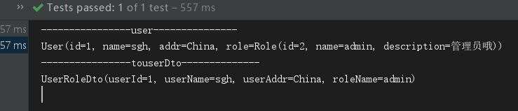

# 1. 前言

官网地址：http://mapstruct.org/

MapStruct 是一个代码生成器，简化了不同的 Java Bean 之间映射的处理，所谓的映射指的就是从一个实体变化成一个实体。例如我们在实际开发中，DAO 层的实体(PO)和一些数据传输对象(DTO)，大部分属性都是相同的，只有少部分的不同，通过 mapStruct，可以让不同实体之间的转换变的简单。我们只需要按照约定的方式进行配置即可。

MapStruct 是一个可以处理注解的 Java 编译器插件，可以在命令行中使用，也可以在 IDE 中使用。MapStruct 有一些默认配置，但是也为用户提供了自己进行配置的途径。

下面进行 MapStruct 的使用。

<!--more-->

# 2. 添加依赖

```xml
       	<dependency>
            <groupId>org.mapstruct</groupId>
            <artifactId>mapstruct-jdk8</artifactId>
            <version>1.2.0.Final</version>
        </dependency>
        <dependency>
            <groupId>org.mapstruct</groupId>
            <artifactId>mapstruct-processor</artifactId>
            <version>1.2.0.Final</version>
        </dependency>
```

# 3. 创建模拟类

假设数据库中有 user 表(包含 id ，用户名，地址，角色这些字段)与 role 表（包含 id ，角色名，描述这些字段)。

假设前端查询 user 的时候只需要用到 userId 、 userName 、 userAddr 与 role 的  roleId 字段时，如果将整个 user 都输出到前端会多出许多没有用的属性。更通用的方式是需要用到的属性封装成一个类( DTO )，通过传输这个类的实例来完成数据传输。

User.java

```java
@Data
public class User {
    private Long id;
    private String name;
    private String addr;
    private Role role;
}
```

Role.java

```java
@Data
public class Role {
    private Long id;
    private String name;
    private String description;
}
```

UserRoleDto.java

```java
@Data
public class UserRoleDto {
    private Long userId;
    private String userName;
    private String userAddr;
    private String roleName;
}

```

# 4. 编写映射类

新建一个 UserRoleMapper.java ，这个类用来定义 User.java 、 Role.java 和 UserRoleDto.java 之间属性对应规则。

```java
@Mapper(componentModel = "spring")
public interface UserMapper {

    @Mappings({
            @Mapping(source = "id", target = "userId"),
            @Mapping(source = "name", target = "userName"),
            @Mapping(source = "addr", target = "userAddr"),
            @Mapping(source = "role.name", target = "roleName"),
    })
    UserRoleDto toUserRoleDto(User user);
}
```

> ## MapStruct中的注解
>
> - @Mapper：注解在接口、类上，这样 MapStruct 才会去实现该接口
>   - componentModel：该属性用于指定实现类的类型，有几个属性：
>     - default：默认，不使用任何组建类型，可以通过Mappers.getMapper(Class) 方式获取实例对象
>     - spring：在实现类上注解 @Component，可通过 @Autowired 方式注入
>     - cdi: the generated mapper is an application-scoped CDI bean and can be retrieved via @Inject
>     - jsr330：实现类上添加@javax.inject.Named 和@Singleton注解，可以通过 @Inject注解获取。
> - @Mappings：配置多个@Mapping
> - @Mapping：配置属性映射，若源对象属性与目标对象名字一致，会自动映射对应属性
>   - source：源属性、target：目标属性
>   - dateFormat：可将 String 到 Date 日期之间相互转换，通过 SimpleDateFormat，该值为 SimpleDateFormat 的日期格式

写完该映射类后，当启动 IDE 的时候 IDE 会帮我们编译， 会自动在 target/classes 下生成对应的实现类，可以查看其实现的方法。

``` java
// 该类为自动生成的
@Generated(
    value = "org.mapstruct.ap.MappingProcessor",
    date = "2019-07-17T21:00:35+0800",
    comments = "version: 1.2.0.Final, compiler: javac, environment: Java 1.8.0_191 (Oracle Corporation)"
)
@Component
public class UserMapperImpl implements UserMapper {

    @Override
    public UserRoleDto toUserRoleDto(User user) {
        if ( user == null ) {
            return null;
        }

        UserRoleDto userRoleDto = new UserRoleDto();

        String name = userRoleName( user );
        if ( name != null ) {
            userRoleDto.setRoleName( name );
        }
        userRoleDto.setUserAddr( user.getAddr() );
        userRoleDto.setUserName( user.getName() );
        userRoleDto.setUserId( user.getId() );

        return userRoleDto;
    }

    private String userRoleName(User user) {
        if ( user == null ) {
            return null;
        }
        Role role = user.getRole();
        if ( role == null ) {
            return null;
        }
        String name = role.getName();
        if ( name == null ) {
            return null;
        }
        return name;
    }
}

```

# 5. 测试

```java
@RunWith(SpringRunner.class)
@SpringBootTest
public class SpringbootMapstructApplicationTests {

    @Autowired
    UserMapper userMapper;

    User user;

    Role role;

    @Before
    public void before() {
        // 模拟数据库数据
        role = new Role(2L, "admin", "管理员哦");
        user = new User(1L, "sgh", "China", role);
    }

    @Test
    public void contextLoads() {
        System.out.println("----------------user---------------");
        System.out.println(user);
        UserRoleDto userRoleDto = userMapper.toUserRoleDto(user);
        System.out.println("----------------touserDto--------------");
        System.out.println(userRoleDto);
    }

}

```

运行结果



可以看到 user.role.name 字段成功映射到了 userRoleDto 的 roleName 字段上。

# 6. 使用实现类的实例进行转换

 UserRoleMapper.java 类修改如下

```java
@Mapper
public interface UserRoleMapper {

    // 获取该类自动生成的实现类的实例
    UserRoleMapper INSTANCE = Mappers.getMapper(UserRoleMapper.class);

    @Mappings({
            @Mapping(source = "id", target = "userId"),
            @Mapping(source = "name", target = "userName"),
            @Mapping(source = "addr", target = "userAddr"),
            @Mapping(source = "role.name", target = "roleName"),
    })
    UserRoleDto toUserRoleDto(User user);
}
```

> Mapper 的 componentModel 属性使用默认的 default (不写即为 default)

测试类修改为

```java
@RunWith(SpringRunner.class)
@SpringBootTest
public class SpringbootMapstructApplicationTests {
    User user;

    Role role;

    @Before
    public void before() {
        // 模拟数据库数据
        role = new Role(2L, "admin", "管理员哦");
        user = new User(1L, "sgh", "China", role);
    }

    @Test
    public void contextLoads() {
        System.out.println("----------------user---------------");
        System.out.println(user);
        UserRoleMapper INSTANCE = UserRoleMapper.INSTANCE;
        UserRoleDto userRoleDto = INSTANCE.toUserRoleDto(user);
        System.out.println("----------------touserDto--------------");
        System.out.println(userRoleDto);
    }

}

```

> 注意区别，因为映射类的 componentModel 不使用 spring , 因此不能通过 @Autowired 来自动注入，需要使用该类的实例来进行转换。
>
> 具体体现在以下两行代码中
>
>  `UserRoleMapper INSTANCE = UserRoleMapper.INSTANCE;`
> `UserRoleDto userRoleDto = INSTANCE.toUserRoleDto(user);`

# 7. 多个参数

可以绑定多个对象的属性值到目标对象中

```java
@Mapper(componentModel = "spring")
public interface UserRoleMapper {
    
    // 使用单一对象
    @Mappings({
            @Mapping(source = "id", target = "userId"),
            @Mapping(source = "name", target = "userName"),
            @Mapping(source = "addr", target = "userAddr"),
            @Mapping(source = "role.name", target = "roleName"),
    })
    UserRoleDto toUserRoleDto(User user);
    
    // 使用两个对象
    @Mappings({
            @Mapping(source = "user.id", target = "userId"),
            @Mapping(source = "user.name", target = "userName"),
            @Mapping(source = "user.addr", target = "userAddr"),
            @Mapping(source = "role.name", target = "roleName"),
    })
    UserRoleDto toUserRoleDto(User user, Role role);
}

```

测试类修改为

```java
@RunWith(SpringRunner.class)
@SpringBootTest
public class SpringbootMapstructApplicationTests {

    @Autowired
    UserRoleMapper userRoleMapper;

    User user;

    Role role;

    @Before
    public void before() {
        // 模拟数据库数据
        role = new Role(2L, "admin", "管理员哦");
        user = new User(1L, "sgh", "China", role);
    }

    @Test
    public void contextLoads() {
        System.out.println("----------------user---------------");
        System.out.println(user);
        UserRoleDto userRoleDto = userRoleMapper.toUserRoleDto(user, role);
        System.out.println("----------------touserDto--------------");
        System.out.println(userRoleDto);
    }

}
```

> 这里使用传两个参数进行属性映射，结果一致

项目代码: https://github.com/ShangguanHong/DemoSpringBoot/tree/master/springboot-mapstruct

# 8. 参考资料

1. [MapStruct超级简单的学习笔记](https://blog.csdn.net/qq122516902/article/details/87259752#5_253)