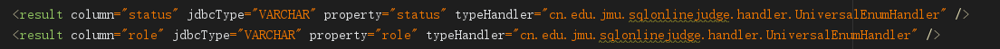
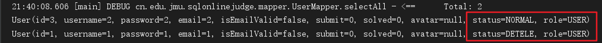

# 1. 前言

在数据库设计中，有的字段需要用字符串来标识，拿用户角色role来说比如`0`代表管理员，`1`代表普通用户。在Java里面定义这样的字段为 `枚举` ，但是一般使用 `mybatis` 查出来的话不符合我们的期望，我们想要让它自动装换成我们想要的枚举，不需要再手动根据数值去判断设置成我们想要的枚举。要是实现这样的效果，那么我们就要用到 `mybatis` 的`BaseTypeHandler` 了。

<!--more-->

# 2. 实现通用转换处理器

1. 定义一个通用枚举接口

```java
public interface BaseEnum<E extends Enum<?>, T> {

    /**
     * 真正与数据库进行映射的值
     */
    public T getValue();

    /**
     * 显示的信息
     */
    public String getDisplayName();
}
```

2. 定义一个枚举实现通用枚举接口

```java
public enum UserRole implements BaseEnum<UserRole, String>{
    /**
     * 普通用户
     */
    USER("0","普通用户"),
    /**
     * 管理员
     */
    ADMIN("1","管理员"),
    ;

    private final String value;
    private final String displayName;
    static Map<String, UserRole> enumMap=new HashMap<String, UserRole>();
    static{
        for(UserRole type:UserRole.values()){
            enumMap.put(type.getValue(), type);
        }
    }

    private UserRole(String value,String displayName) {
        this.value=value;
        this.displayName=displayName;
    }

    @Override
    public String getValue() {
        return this.value;
    }

    @Override
    public String getDisplayName() {
        return this.displayName;
    }

    public static UserRole getEnum(String value) {
        return enumMap.get(value);
    }
}
```

3. 定义万能枚举转换处理器

```java
@MappedTypes({UserRole.class})
public final class UniversalEnumHandler<E extends BaseEnum> extends BaseTypeHandler<E> {

    private Class<E> type;
    private E [] enums;

    /**
     * 设置配置文件设置的转换类以及枚举类内容，供其他方法更便捷高效的实现
     * @param type 配置文件中设置的转换类
     */
    public UniversalEnumHandler(Class<E> type) {
        if (type == null)
            throw new IllegalArgumentException("Type argument cannot be null");
        this.type = type;
        this.enums = type.getEnumConstants();
        if (this.enums == null)
            throw new IllegalArgumentException(type.getSimpleName()
                    + " does not represent an enum type.");
    }

    @Override
    public void setNonNullParameter(PreparedStatement ps, int i, E parameter,
                                    JdbcType jdbcType) throws SQLException {
        //BaseTypeHandler已经帮我们做了parameter的null判断
        ps.setObject(i,(String)parameter.getValue(), jdbcType.TYPE_CODE);
    }

    @Override
    public E getNullableResult(ResultSet rs, String columnName)
            throws SQLException {
        // 根据数据库存储类型决定获取类型，本例子中数据库中存放String类型
        String i = rs.getString(columnName);
        if (rs.wasNull()) {
            return null;
        } else {
            // 根据数据库中的value值，定位PersonType子类
            return locateEnumStatus(i);
        }
    }

    @Override
    public E getNullableResult(ResultSet rs, int columnIndex)
            throws SQLException {
        // 根据数据库存储类型决定获取类型，本例子中数据库中存放String类型
        String i = rs.getString(columnIndex);
        if (rs.wasNull()) {
            return null;
        } else {
            // 根据数据库中的value值，定位PersonType子类
            return locateEnumStatus(i);
        }
    }

    @Override
    public E getNullableResult(CallableStatement cs, int columnIndex)
            throws SQLException {
        // 根据数据库存储类型决定获取类型，本例子中数据库中存放String类型
        String i = cs.getString(columnIndex);
        if (cs.wasNull()) {
            return null;
        } else {
            // 根据数据库中的value值，定位PersonType子类
            return locateEnumStatus(i);
        }
    }

    /**
     * 枚举类型转换，由于构造函数获取了枚举的子类enums，让遍历更加高效快捷
     * @param value 数据库中存储的自定义value属性
     * @return value对应的枚举类
     */
    private E locateEnumStatus(String value) {
        for(E e : enums) {
            if(e.getValue().equals(value)) {
                return e;
            }
        }
        throw new IllegalArgumentException("未知的枚举类型：" + value + ",请核对" + type.getSimpleName());
    }
}
```

`MappedTypes` 注解必须在该处理器(及其子类)上,参数是要具体处理的枚举Class对象，多个之间可以用逗号分隔。如：

`@MappedTypes({UserRole.class, ****.class})`

4. 配置文件

在项目配置文件中添加 `mybatis.typeHandlersPackage= ***` ，`***` 替换为你的 `UniversalEnumHandler` 所在的包名

将 `mapper.xml` 里的枚举字段增加 `typeHandler` 为 `UniversalEnumHandler`所在的位置



5. 测试



可以看到字段取出来即为我们期望的

# 3. 参考资料

1. [mybatis枚举自动转换（通用转换处理器实现）](https://blog.csdn.net/fighterandknight/article/details/51520595)
2. [SpringBoot整合Mybatis实现自动转换枚举类型](https://blog.csdn.net/qq_26440803/article/details/83451221)