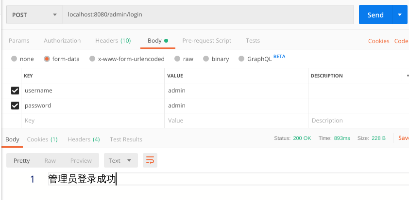
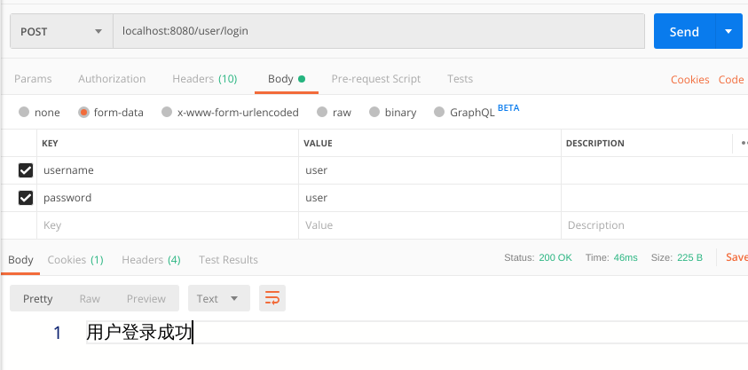
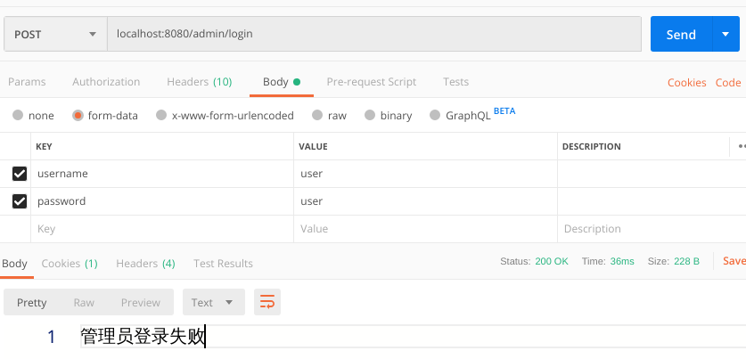
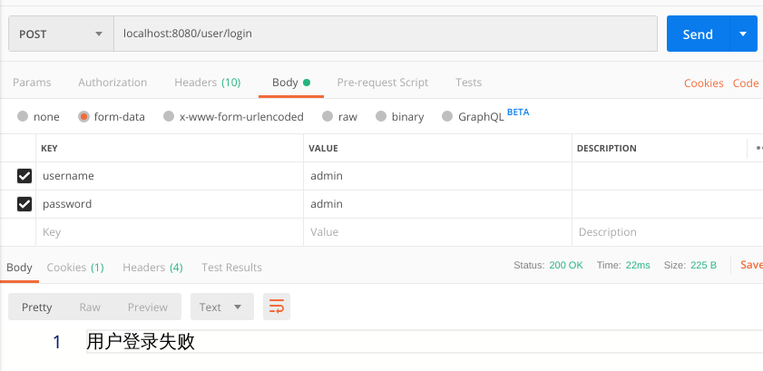

# 前言

之前写了一篇 [Spring Boot整合Shiro](https://shangguanhong.github.io/2019/08/20/Spring-Boot整合Shiro/)，如果不了解 `Shiro` 的建议先去阅读之前的文章，因为这篇是在它的基础上进行的拓展，需要您具备一定的 Shiro 知识。

之前所介绍的 Shiro 仅仅是针对单个 Realm 的使用，但是考虑一下以下场景：

> 数据库内有两个表，一个是用户表，用户是指可以通过注册、登录从而使用系统的对象，而另一个是管理员表，管理员的职责就是通过后端写好的接口，来进行对后台的管理，包括但不限于对用户做增删改查操作。

在此场景下如果想使用 Shiro 就不能使用单个的 Realm 来做判断了，此时我们就需要采用多 Realm 配置模式来完成对不同类型的登录转到不同的 Realm，从而进行不同的认证和权限配置。

**下面一部分代码不贴出来（如，数据库配置等），因为与上篇的内容重复了**， 有不清楚的地方可以点击 [完整源码](https://github.com/ShangguanHong/SpringBootDemo/tree/master/shiro-multiple-realm) 查看。

<!--more-->

# 配置多Realm


查看 Shiro 登录的源码可以看到在一个 `ModularRealmAuthenticator` 类里面有一个方法叫做 `doAuthenticate` ，其代码如下：

```java
protected AuthenticationInfo doAuthenticate(AuthenticationToken authenticationToken) throws AuthenticationException {
	this.assertRealmsConfigured();
	Collection<Realm> realms = this.getRealms();
	return realms.size() == 1 ? this.doSingleRealmAuthentication((Realm)realms.iterator().next(), authenticationToken) : 		this.doMultiRealmAuthentication(realms, authenticationToken);
}
```

这里的 `this.GetRealms()` 得到的是之前我们在 `ShiroConfig.java` 的 `securityManager()` 方法内配置的所有 Realm

```java
    @Bean
    public SecurityManager securityManager() {
        DefaultWebSecurityManager securityManager = new DefaultWebSecurityManager();
        securityManager.setRealm(myRealm());
        return securityManager;
    }
```

我们需要做的就是重写 `doAuthenticate` 方法，指定对于不同登录我们需要使用不同的 Realm 来进行验证。

那么如何能够做到根据我们自己的逻辑来使用不同的 Realm 呢？可以看到 `doAuthenticate` 方法传入了一个 `authenticationToken` ，我们的 `UsernamePasswordToken` 就是继承自 `authenticationToken`，那么我们可以创建一个自定义的 `UserToken` 继承自 `UsernamePasswordToken` ，这里面有一个 `loginType` 字段来标示当前登录的是用户还是管理员，然后在 `doAuthenticate` 中取出来进行逻辑判断即可。

`UserToken.java`

```java
@EqualsAndHashCode(callSuper = true)
@Data
public class UserToken extends UsernamePasswordToken {
    /**
     * 登录类型
     */
    private String loginType;

    public UserToken(String username, String password, String loginType) {
        super(username, password);
        this.loginType = loginType;
    }
}


```

新建一个 `UserModularRealmAuthenticator.java` 继承 `ModularRealmAuthenticator` 来重写 `doAuthenticate` 方法

```Java
@Slf4j
public class UserModularRealmAuthenticator extends ModularRealmAuthenticator {

    /**
     * 自定义doAuthenticator
     */
    @Override
    protected AuthenticationInfo doAuthenticate(AuthenticationToken authenticationToken) throws AuthenticationException {
        log.debug("UserModularRealmAuthenticator----------->doAuthenticate");
        // 强制转换回自定义的UserToken
        UserToken userToken = (UserToken) authenticationToken;
        // 获取登录类型
        String loginType = userToken.getLoginType();
        // 获取所有Realm
        Collection<Realm> realms = getRealms();
        // 登录类型对应的所有Realm
        Collection<Realm> typeRealms = new ArrayList<>();
        realms.forEach(realm -> {
            // 利用 realm 的全限定包名来进行判断
            if (realm.getName().contains(loginType)) {
                typeRealms.add(realm);
            }
        });
        if (typeRealms.size() == 1) {
            return doSingleRealmAuthentication(typeRealms.iterator().next(), userToken);
        } else {
            return doMultiRealmAuthentication(typeRealms, userToken);
        }
    }
}
```

接着创建两个 Realm， `UserRealm` 和 `AdminRealm` 来分别处理用户登录和管理员登录的认证和授权。

`UserRealm.java`

```java
@Slf4j
public class UserRealm extends AuthorizingRealm {

    @Resource
    private UserInfoRepository userInfoRepository;

    @Override
    protected AuthorizationInfo doGetAuthorizationInfo(PrincipalCollection principalCollection) {
        log.debug("UserRealm------------------->doGetAuthorizationInfo");
        // 应该从数据库中读取并且采用缓存的机制
        // 这里为了简单就写死了
        SimpleAuthorizationInfo info = new SimpleAuthorizationInfo();
        info.addRole("user");
        return info;
    }

    @Override
    protected AuthenticationInfo doGetAuthenticationInfo(AuthenticationToken authenticationToken) throws AuthenticationException {
        log.debug("UserRealm---------------->doGetAuthenticationInfo");
        // 1. 把AuthenticationToken转换为UserToken
        UserToken userToken = (UserToken) authenticationToken;
        // 2. 从UserToken中获取username
        String username = userToken.getUsername();
        // 3. 若用户不存在，抛出UnknownAccountException异常
        UserInfo user = userInfoRepository.findByUsername(username);
        if (user == null) {
            throw new UnknownAccountException("用户不存在！");
        }
        // 4. 根据用户的情况，来构建AuthenticationInfo对象并返回，通常使用的实现类为SimpleAuthenticationInfo
        return new SimpleAuthenticationInfo(user, user.getPassword(), getName());
    }
}
```

`AdminRealm.java`

```java
@Slf4j
public class AdminRealm extends AuthorizingRealm {

    @Resource
    private SysAdminRepository sysAdminRepository;

    @Override
    protected AuthorizationInfo doGetAuthorizationInfo(PrincipalCollection principalCollection) {
        log.debug("AdminRealm---------------->doGetAuthorizationInfo");
        SimpleAuthorizationInfo info = new SimpleAuthorizationInfo();
        // 应该从数据库中读取并且采用缓存的机制
        // 这里为了简单就写死了
        info.addRole("admin");
        return info;
    }

    @Override
    protected AuthenticationInfo doGetAuthenticationInfo(AuthenticationToken authenticationToken) throws AuthenticationException {
        log.debug("AdminRealm------------------->doGetAuthenticationInfo");
        // 1. 把AuthenticationToken转换为UserToken
        UserToken userToken = (UserToken) authenticationToken;
        // 2. 从UserToken中获取username
        String username = userToken.getUsername();
        // 3. 若用户不存在，抛出UnknownAccountException异常
        SysAdmin admin = sysAdminRepository.findByUsername(username);
        if (admin == null) {
            throw new UnknownAccountException("用户不存在！");
        }
        // 4. 根据用户的情况，来构建AuthenticationInfo对象并返回，通常使用的实现类为SimpleAuthenticationInfo
        return new SimpleAuthenticationInfo(admin, admin.getPassword(), getName());
    }
}
```

可以看到这两个类的内容大体上是一致的，就是访问的数据库不同而已，当然处理方法因人而异，比如可以对用户做一些状态的判断抛出不同的异常等等。

最后我们修改一下 `ShiroConfig.java` 注入我们自定义的 `UserModularRealmAuthenticator`、`UserRealm`、`AdminRealm` 即可

```java
@Configuration
public class ShiroConfig {

    @Bean
    public ShiroFilterFactoryBean shiroFilter(SecurityManager securityManager) {
        System.out.println("ShiroConfiguration.shiroFilter()");
        ShiroFilterFactoryBean shiroFilterFactoryBean = new ShiroFilterFactoryBean();
        shiroFilterFactoryBean.setSecurityManager(securityManager);
        // 拦截器
        Map<String, String> filterChainDefinitionMap = new LinkedHashMap<>();
        // 配置不会被拦截的链接 顺序判断
        filterChainDefinitionMap.put("/static/**", "anon");
        filterChainDefinitionMap.put("/admin/login", "anon");
        filterChainDefinitionMap.put("/user/login", "anon");
        // 配置退出过滤器,其中的具体的退出代码Shiro已经替我们实现了
        filterChainDefinitionMap.put("/logout", "logout");
        // <!-- 过滤链定义，从上向下顺序执行，一般将/**放在最为下边 -->:这是一个坑呢，一不小心代码就不好使了;
        // <!-- authc:所有url都必须认证通过才可以访问; anon:所有url都都可以匿名访问-->
        filterChainDefinitionMap.put("/**", "authc");
        // 如果不设置默认会自动寻找Web工程根目录下的"/login.jsp"页面
        shiroFilterFactoryBean.setLoginUrl("/user/login");
        // 登录成功后要跳转的链接
        shiroFilterFactoryBean.setSuccessUrl("/index");
        // 未授权界面;
        shiroFilterFactoryBean.setUnauthorizedUrl("/403");
        shiroFilterFactoryBean.setFilterChainDefinitionMap(filterChainDefinitionMap);
        return shiroFilterFactoryBean;
    }

    @Bean
    public SecurityManager securityManager() {
        DefaultWebSecurityManager securityManager = new DefaultWebSecurityManager();
        // 使用我们定义的Authenticator
        securityManager.setAuthenticator(userModularRealmAuthenticator());
        List<Realm> realms = new ArrayList<>();
        realms.add(adminRealm());
        realms.add(userRealm());
        securityManager.setRealms(realms);
        return securityManager;
    }

    @Bean
    public UserModularRealmAuthenticator userModularRealmAuthenticator() {
        UserModularRealmAuthenticator userModularRealmAuthenticator = new UserModularRealmAuthenticator();
        userModularRealmAuthenticator.setAuthenticationStrategy(new AtLeastOneSuccessfulStrategy());
        return userModularRealmAuthenticator;
    }

    @Bean
    public AdminRealm adminRealm() {
        return new AdminRealm();
    }

    @Bean
    public UserRealm userRealm() {
        return new UserRealm();
    }

    /**
     * 开启shiro aop注解支持.
     * 使用代理方式;所以需要开启代码支持;
     *
     * @param securityManager securityManager
     * @return AuthorizationAttributeSourceAdvisor
     */
    @Bean
    public AuthorizationAttributeSourceAdvisor authorizationAttributeSourceAdvisor(SecurityManager securityManager) {
        AuthorizationAttributeSourceAdvisor authorizationAttributeSourceAdvisor = new AuthorizationAttributeSourceAdvisor();
        authorizationAttributeSourceAdvisor.setSecurityManager(securityManager);
        return authorizationAttributeSourceAdvisor;
    }
```

# 测试

`HomeController.java`

```java
@RestController
public class HomeController {

    @RequestMapping("/user/login")
    public String userLogin(@RequestParam(value = "username") String username,
                            @RequestParam(value = "password") String password) throws Exception {
        // 得到当前 subject
        Subject subject = SecurityUtils.getSubject();
        UserToken userToken = new UserToken(username, password, LoginTypeEnum.USER.getType());
        try {
            subject.login(userToken);
            return "用户登录成功";
        } catch (Exception e) {
            return "用户登录失败";
        }
    }

    @RequestMapping("/admin/login")
    public String adminLogin(@RequestParam(value = "username") String username,
                             @RequestParam(value = "password") String password) throws Exception {
        // 得到当前 subject
        Subject subject = SecurityUtils.getSubject();
        UserToken userToken = new UserToken(username, password, LoginTypeEnum.ADMIN.getType());
        try {
            subject.login(userToken);
            return "管理员登录成功";
        } catch (Exception e) {
            return "管理员登录失败";
        }
    }
}
```

利用 PostMan 来进行接口测试

访问管理员登录接口时：



访问用户登录接口时：



当用管理员的账号密码访问用户登录接口时：



当用用户的账号密码访问管理员登录接口时：




可以看到根据不同的接口系统调用了不用的 Realm 来验证登录信息，从而做到将不同功能的用户区分开来。