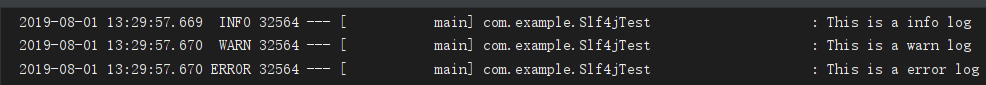

# 1. 前言

>Slf4j的全称是Simple Loging Facade For Java(Java简单日志门面)，它仅仅是一个为Java程序提供日志输出的统一接口，并不是一个具体的日志实现方案，就比如JPA一样，只是一种规则而已。所以单独的Slf4j是不能工作的，必须搭配其他具体的日志实现方案，比如apache的org.apache.log4j.Logger，jdk自带的java.util.logging.Logger等。
>
>logback和log4j以及log4j2三者，推荐使用logback，因为logback的效率显著高于log4j，而且logback也是Springboot推荐并且默认使用的日志系统。

下面介绍 slf4j + logback 在 springboot 下的使用。

<!--more-->


# 2. 配置 logback.xml

springboot项目自动引入了slf4j+logback的依赖，并且做了自动配置，可以直接开始用，如下 

**注意导入的包**

```java
package com.example;

import org.junit.Test;
import org.junit.runner.RunWith;
import org.slf4j.Logger;
import org.slf4j.LoggerFactory;
import org.springframework.boot.test.context.SpringBootTest;
import org.springframework.test.context.junit4.SpringRunner;

@RunWith(SpringRunner.class)
@SpringBootTest
public class Slf4jTest {
    private final Logger logger = LoggerFactory.getLogger(Slf4jTest.class);

    @Test
    public void test() {
        logger.trace("This is a trace log");
        logger.debug("This is a debug log");
        logger.info("This is a info log");
        logger.warn("This is a warn log");
        logger.error("This is a error log");
    }
}
```




>日志级别排序：error > warn > info > debug > trace
>
>这里不显示 trace 和 debug 是因为默认只输出 info 级别的(**优先级别高的包含在优先级别低的里面**)
>
>也就是说如果定义成 trace 级别那么 所有类型的日志都将被打印出来，反之，如果定义成error级别的，那么将只打印出error类型的日志

一些简单的配置可以在 `application.properties` 文件中进行配置

```properties
# 日志相关配置

# 配置日志配置文件
logging.config=classpath:logback-spring.xml
# 日志输出路径
log.path=/logs
# 日志文件
logging.file=demo.log
# 日志级别
logging.level=INFO
# 根项目日志级别
logging.level.root=INFO
# 自定义包下的日志级别
logging.level.com.example=DEBUG
```


如果想要更多复杂的配置（例如：按天数、类型分类日志等）就需要使用 xml 文件来进行配置

> 首先，官方推荐使用的xml名字的格式为：logback-spring.xml而不是logback.xml。
>
> logback和logback-spring.xml都可以用来配置logback，但是2者的加载顺序是不一样的。
>
> logback.xml--->application.properties--->logback-spring.xml.
>
> logback.xml加载早于application.properties，所以如果你在logback.xml使用了变量时，而恰好这个变量是写在application.properties时，那么就会获取不到，只要改成logback-spring.xml就可以解决。

在 `resource` 下创建 `logback-spring.xml` 文件

**logback-spring.xml** 配置如下

```xml
<?xml version="1.0" encoding="UTF-8"?>
<!--
scan：当此属性设置为true时，配置文件如果发生改变，将会被重新加载，默认值为true。
scanPeriod：设置监测配置文件是否有修改的时间间隔，如果没有给出时间单位，默认单位是毫秒。当scan为true时，此属性生效。默认的时间间隔为1分钟。
debug：当此属性设置为true时，将打印出logback内部日志信息，实时查看logback运行状态。默认值为false。
-->
<configuration scan="true" scanPeriod="60 seconds" debug="false">
    <!-- 保存日志文件的根目录,这个根据自己需求修改 -->
    <property name="base_log_dir" value="logs/"/>
    <!-- 定义日志文件名称 -->
    <contextName>Demo</contextName>
	<!------------------------------------控制台-------------------------------------------------------->
    <!-- 配置输出到控制台的日志样式 -->
    <appender name="console" class="ch.qos.logback.core.ConsoleAppender">
        <!--<encoder>表示对日志进行编码：-->
        <!--日志输出格式：
            %red %green %highlight %boldMagenta——输出颜色
            %d{HH: mm:ss.SSS}——日志输出时间
            %thread——输出日志的进程名字，这在Web应用以及异步任务处理中很有用
            %-5level——日志级别，并且使用5个字符靠左对齐
            %logger{36}——日志输出者的名字
            %msg——日志消息
            %n——平台的换行符
        -->
        <encoder>
            <!--日志文件输出格式-->
            <pattern>%red(%d{yyyy-MM-dd HH:mm:ss.SSS}) %green([%thread]) %highlight(%-5level) %boldMagenta(%logger{36}) - %msg%n</pattern>
            <!-- 设置字符集 -->
            <charset>UTF-8</charset>
        </encoder>
    </appender>
    <!-------------------------------时间滚动输出 level为 error 日志-------------------------------------------------------->
    <!-- 配置输出到文件的日志样式，滚动记录文件，先将日志记录到指定文件，当符合某个条件时，将日志记录到其他文件 -->
    <appender name="error" class="ch.qos.logback.core.rolling.RollingFileAppender">
        <!-- 指定日志文件的名称 -->
        <file>${base_log_dir}/error.log</file>
        <!-- 此日志文件只记录error级别的 -->
        <filter class="ch.qos.logback.classic.filter.LevelFilter">
            <level>ERROR</level>
            <onMatch>ACCEPT</onMatch>
            <onMismatch>DENY</onMismatch>
        </filter>
        <!--
	    设置滚动策略
        当发生滚动时，决定 RollingFileAppender 的行为，涉及文件移动和重命名
        TimeBasedRollingPolicy： 最常用的滚动策略，它根据时间来制定滚动策略，既负责滚动也负责出发滚动。
        -->
        <rollingPolicy class="ch.qos.logback.core.rolling.TimeBasedRollingPolicy">
            <!--设置日志命名模式:根据日期命名-->
            <fileNamePattern>${base_log_dir}/error/error-%d{yyyy-MM-dd.%i.log</fileNamePattern>
            <!--最多保留15天日志文件，默认30天-->
            <maxHistory>15</maxHistory>
            <!-- 设置每个日志文件的最大文件大小，超过指定大小后，会将日志文件进行拆分 0,1,2... -->
            <timeBasedFileNamingAndTriggeringPolicy class="ch.qos.logback.core.rolling.SizeAndTimeBasedFNATP">
                <maxFileSize>50MB</maxFileSize>
            </timeBasedFileNamingAndTriggeringPolicy>
        </rollingPolicy>
        <!--日志文件输出格式-->
        <encoder>
            <pattern>%d{yyyy-MM-dd HH:mm:ss.SSS} %thread %-5level %X{invokeNo} %logger{40} %msg%n</pattern>
            <charset>UTF-8</charset>
        </encoder>
    </appender>
  
    <!-------------------------------时间滚动输出 level为 warn 日志-------------------------------------------------------->
    <!------------------------------- 配置说明与error一致，不重复赘述------------------------------------------------------->
    <appender name="warn" class="ch.qos.logback.core.rolling.RollingFileAppender">
        <file>${base_log_dir}/warn.log</file>
        <filter class="ch.qos.logback.classic.filter.LevelFilter">
            <level>warn</level>
            <onMatch>ACCEPT</onMatch>
            <onMismatch>DENY</onMismatch>
        </filter>
        <rollingPolicy class="ch.qos.logback.core.rolling.TimeBasedRollingPolicy">
            <fileNamePattern>${base_log_dir}/warn/warn-%d{yyyy-MM-dd}.%i.log</fileNamePattern>
            <maxHistory>15</maxHistory>
            <timeBasedFileNamingAndTriggeringPolicy class="ch.qos.logback.core.rolling.SizeAndTimeBasedFNATP">
                <maxFileSize>50MB</maxFileSize>
            </timeBasedFileNamingAndTriggeringPolicy>
        </rollingPolicy>
        <encoder>
            <pattern>%d{yyyy-MM-dd HH:mm:ss.SSS} %thread %-5level %X{invokeNo} %logger{40} %msg%n</pattern>
            <charset>UTF-8</charset>
        </encoder>
    </appender>
	
    <!-------------------------------时间滚动输出 level为 info 日志-------------------------------------------------------->
    <!------------------------------- 配置说明与error一致，不重复赘述------------------------------------------------------->
    <appender name="info" class="ch.qos.logback.core.rolling.RollingFileAppender">
        <file>${base_log_dir}/info.log</file>
        <filter class="ch.qos.logback.classic.filter.LevelFilter">
            <level>INFO</level>
            <onMatch>ACCEPT</onMatch>
            <onMismatch>DENY</onMismatch>
        </filter>
        <rollingPolicy class="ch.qos.logback.core.rolling.TimeBasedRollingPolicy">
            <fileNamePattern>${base_log_dir}/info/info-%d{yyyy-MM-dd}.log</fileNamePattern>
            <maxHistory>15</maxHistory>
            <timeBasedFileNamingAndTriggeringPolicy class="ch.qos.logback.core.rolling.SizeAndTimeBasedFNATP">
                <maxFileSize>50MB</maxFileSize>
            </timeBasedFileNamingAndTriggeringPolicy>
        </rollingPolicy>
        <encoder>
            <pattern>%d{yyyy-MM-dd HH:mm:ss.SSS} %thread %-5level %X{invokeNo} %logger{40} %msg%n</pattern>
        </encoder>
    </appender>
	
    <!-------------------------------时间滚动输出 level为 debug 日志-------------------------------------------------------->
    <!------------------------------- 配置说明与error一致，不重复赘述------------------------------------------------------->
    <appender name="debug" class="ch.qos.logback.core.rolling.RollingFileAppender">
        <file>${base_log_dir}/debug.log</file>
        <filter class="ch.qos.logback.classic.filter.LevelFilter">
            <level>DEBUG</level>
            <onMatch>ACCEPT</onMatch>
            <onMismatch>DENY</onMismatch>
        </filter>
        <rollingPolicy class="ch.qos.logback.core.rolling.TimeBasedRollingPolicy">
            <fileNamePattern>${base_log_dir}/debug/debug-%d{yyyy-MM-dd}.%i.log</fileNamePattern>
            <maxHistory>15</maxHistory>
            <timeBasedFileNamingAndTriggeringPolicy class="ch.qos.logback.core.rolling.SizeAndTimeBasedFNATP">
                <maxFileSize>50MB</maxFileSize>
            </timeBasedFileNamingAndTriggeringPolicy>
        </rollingPolicy>
        <encoder>
            <pattern>%d{yyyy-MM-dd HH:mm:ss.SSS} %thread %-5level %X{invokeNo} %logger{40} %msg%n</pattern>
            <charset>UTF-8</charset>
        </encoder>
    </appender>

    <!-------------------------------时间滚动输出 framework 日志-------------------------------------------------------->
    <!------------------------------- 配置说明与error一致，不重复赘述------------------------------------------------------->
    <appender name="framework" class="ch.qos.logback.core.rolling.RollingFileAppender">
        <file>${base_log_dir}/framework.log</file>
        <rollingPolicy class="ch.qos.logback.core.rolling.TimeBasedRollingPolicy">
            <fileNamePattern>${base_log_dir}/framework/framework-%d{yyyy-MM-dd}.%i.log</fileNamePattern>
            <maxHistory>15</maxHistory>
            <timeBasedFileNamingAndTriggeringPolicy class="ch.qos.logback.core.rolling.SizeAndTimeBasedFNATP">
                <maxFileSize>50MB</maxFileSize>
            </timeBasedFileNamingAndTriggeringPolicy>
        </rollingPolicy>
        <encoder>
            <pattern>%d{yyyy-MM-dd HH:mm:ss.SSS} [%thread] %-5level %logger{50} %msg%n</pattern>
            <charset>UTF-8</charset>
        </encoder>
    </appender>
    
    <!--
        <logger>用来设置某一个包或者具体的某一个类的日志打印级别、以及指定<appender>。
	    <logger>仅有一个name属性，一个可选的level和一个可选的addtivity属性。
        name:用来指定受此logger约束的某一个包或者具体的某一个类。
        level:用来设置打印级别
        addtivity:是否向上级logger传递打印信息。默认是true。
    -->
    <!--
        使用mybatis的时候，sql语句是debug下才会打印，而默认是info级别，所以想要查看sql语句的话，有以下两种操作：
        第一种把<root level="info">改成<root level="debug">这样就会打印sql，不过这样日志那边会出现很多其他消息
        第二种就是单独给dao下目录配置debug模式，这样配置sql语句会打印，其他还是正常info级别
     -->
    <!--
        root节点是必选节点，用来指定最基础的日志输出级别，只有一个level属性
        level:用来设置打印级别，默认是info
        可以包含零个或多个元素，标识这个appender将会添加到这个logger。
   	    root与logger是父子关系，没有特别定义则默认为root，任何一个类只会和一个logger对应，
        要么是定义的logger，要么是root，判断的关键在于找到这个logger，然后判断这个logger的appender和level。 
    -->

    <!--普通日志输出到控制台-->
    <root level="info">
        <appender-ref ref="console"/>
        <appender-ref ref="info"/>
        <appender-ref ref="warn"/>
        <appender-ref ref="error"/>
    </root>
	
    <!-- spring框架日志 -->
    <logger name="org.springframework" level="debug" additivity="false">
        <appender-ref ref="framework"/>
    </logger>
	
    <!--特别指定该目录下为debug模式-->
    <logger name="com.example" level="debug" additivity="false">
        <appender-ref ref="debug"/>
        <appender-ref ref="info"/>
        <appender-ref ref="error"/>
        <appender-ref ref="console"/>
    </logger>
    
    <!--开发环境:打印控制台-->
    <springProfile name="dev">
        <logger name="com.example" level="debug"/>
    </springProfile>
    
    <!--生产环境:输出到文件-->
    <!--<springProfile name="pro">-->
        <!--<root level="info">-->
            <!--<appender-ref ref="console" />-->
            <!--<appender-ref ref="debug" />-->
            <!--<appender-ref ref="info" />-->
            <!--<appender-ref ref="warn" />-->
            <!--<appender-ref ref="error" />-->
        <!--</root>-->
    <!--</springProfile>-->
</configuration>
```


# 3. 参考资料

1.  [logback-spring.xml配置](https://www.cnblogs.com/xm-02/p/9109563.html)
2.  [SpringBoot整合Slf4j+logback日志框架](https://www.cnblogs.com/gavincoder/p/10090592.html)

3.  [springboot2.0整合logback日志(详细)](https://www.cnblogs.com/zhangjianbing/p/8992897.html)
4.  [springboot的logback.xml配置和日志记录](https://www.cnblogs.com/javalanger/p/10964603.html)