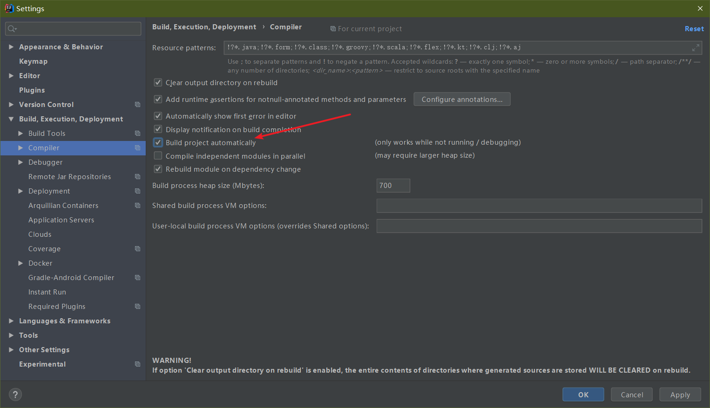
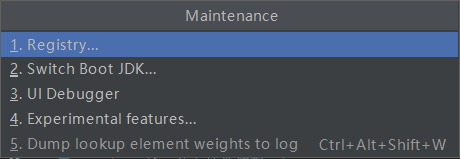
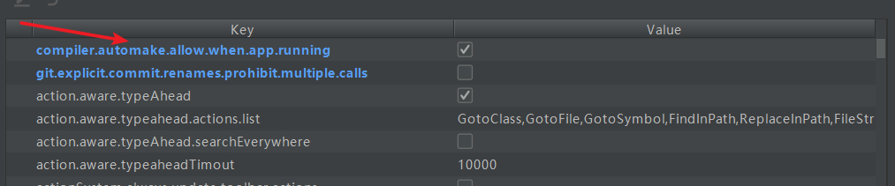
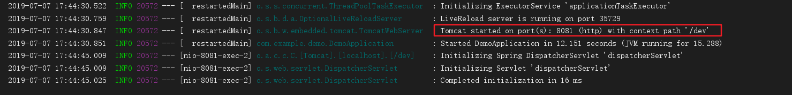

# 1. 前言

我们在开发中反复修改类、页面等资源，每次修改后都是需要重新启动服务才能使得修改生效，这是非常麻烦的，浪费了大量的时间。我们能够在修改代码之后不重启服务就能使修改生效，我们称之为热部署，下面进行Spring-Boot实现热部署的过程。

<!--more-->

# 2. 配置

1. 在pom.xml中添加如下依赖

```xml
        <!--热部署配置-->
        <dependency>
            <groupId>org.springframework.boot</groupId>
            <artifactId>spring-boot-devtools</artifactId>
        </dependency>
```

> 如果你使用的是IDEA开发，那么你还要进行下面3步操作，否则跳过即可。

2. 点击 file->settings->build,execution,deployment->complier, 在右边找到 `build project automatically` ，将其打上勾，点击 `OK` 



3. 回到idea界面， 同时按下 `shift + ctrl + alt + /` , 显示一个界面点击进入 `Registry`

4. 在跳出来的界面寻找 `complier.automake.allow.when.app.running` key，将其后面的value打上勾，然后关闭页面即可

   

# 3. 测试

下面进行测试，查看配置热部署是否成功

测试代码

```java
@RestController
public class TestController {
    @RequestMapping(value = "/test", method = RequestMethod.GET)
    public String test() {
        return "Hello World!";
    }
}
```

运行程序，查看输出信息



在浏览器输入localhost:8081/dev/test


修改代码，可以看到下面的服务自动重启，

然后刷新界面


可以看到页面已经改成修改后的样子，热部署成功！