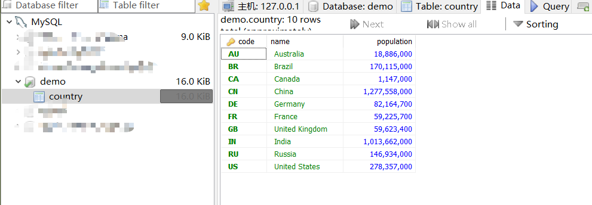
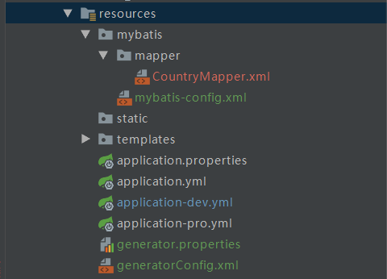
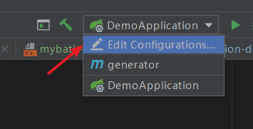
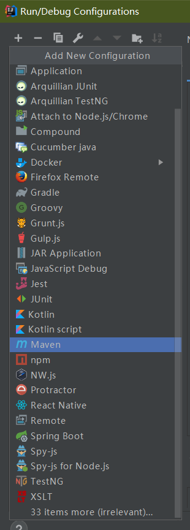
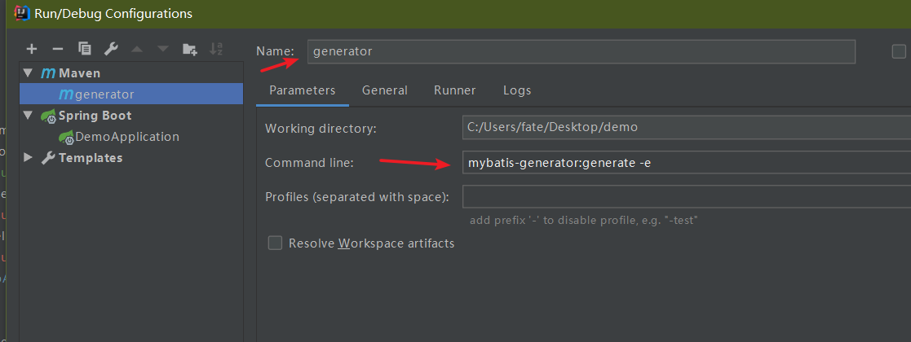
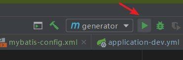
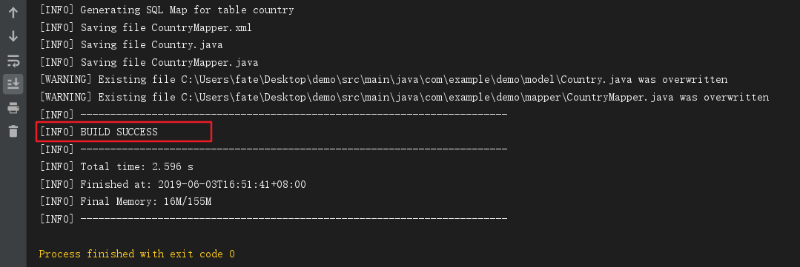
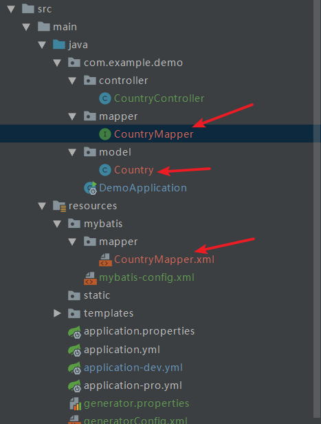
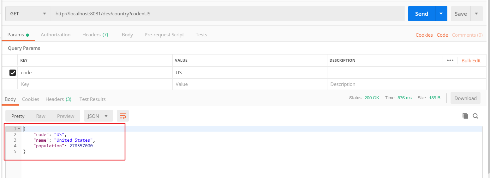

# 1. 前言

本文介绍如何将mybatis整合进Spring Boot,  并且使用mybatis-generator插件自动根据数据库生成一些基本的代码。

> 本文用的是mybatis的xml配置模式，它还有一种注解模式，需要了解的可以搜索学习
>
> 本文开发环境为  JDK1.8 + mybatis3 + IDEA。

项目代码: https://github.com/ShangguanHong/DemoSpringBoot/tree/master/springboot_mybatis

<!--more-->

# 2. 配置pom.xml

1. 加入数据库依赖

```xml
        <dependency>
            <groupId>org.mybatis.spring.boot</groupId>
            <artifactId>mybatis-spring-boot-starter</artifactId>
            <version>2.0.0</version>
        </dependency>
        <dependency>
            <groupId>mysql</groupId>
            <artifactId>mysql-connector-java</artifactId>
            <version>5.1.47</version>
        </dependency>
        <dependency>
            <groupId>com.alibaba</groupId>
            <artifactId>druid-spring-boot-starter</artifactId>
            <version>1.1.10</version>
        </dependency>


```

2. 加入mybatis-generator插件

```xml
            <plugin>
                <groupId>org.mybatis.generator</groupId>
                <artifactId>mybatis-generator-maven-plugin</artifactId>
                <version>1.3.2</version>
                <configuration>
                    <verbose>true</verbose>
                    <overwrite>true</overwrite>
                </configuration>
            </plugin>
```

# 3. mybatis-generator自动生成代码

我的数据库如下



创建代码如下

```mysql
CREATE DATABASE IF NOT EXISTS `demo` 
USE `demo`;

CREATE TABLE IF NOT EXISTS `country` (
  `code` varchar(2) NOT NULL,
  `name` varchar(50) NOT NULL,
  `population` int(11) NOT NULL DEFAULT '0',
  PRIMARY KEY (`code`)
) ENGINE=InnoDB DEFAULT CHARSET=utf8;

INSERT INTO `country` (`code`, `name`, `population`) VALUES
	('AU', 'Australia', 18886000),
	('BR', 'Brazil', 170115000),
	('CA', 'Canada', 1147000),
	('CN', 'China', 1277558000),
	('DE', 'Germany', 82164700),
	('FR', 'France', 59225700),
	('GB', 'United Kingdom', 59623400),
	('IN', 'India', 1013662000),
	('RU', 'Russia', 146934000),
	('US', 'United States', 278357000);
```

项目目录如下



1.  编写配置文件

`generator.properties` 中的内容为

```properties
# 本地jdbc驱动地址
jdbc.driverLocation=C:\\Users\\fate\\.m2\\repository\\mysql\\mysql-connector-java\\5.1.47\\mysql-connector-java-5.1.47.jar
# 使用jdbc驱动类型
jdbc.driverClass=com.mysql.jdbc.Driver
# jdbc连接URL
jdbc.connectionURL=jdbc:mysql://localhost:3306/demo?serverTimezone=UTC&useUnicode=true&characterEncoding=utf-8&useSSL=true
# 用户名
jdbc.userId=root
# 密码
jdbc.password=root
```

`generatorConfig.xml` 中的内容如下

```xml
<?xml version="1.0" encoding="UTF-8"?>
<!DOCTYPE generatorConfiguration
        PUBLIC "-//mybatis.org//DTD MyBatis Generator Configuration 1.0//EN"
        "http://mybatis.org/dtd/mybatis-generator-config_1_0.dtd">
<generatorConfiguration>
    <!--导入属性配置-->
    <properties resource="generator.properties"></properties>
    <!-- 数据库驱动:选择你的本地硬盘上面的数据库驱动包-->
    <classPathEntry  location="${jdbc.driverLocation}"/>
    <context id="demo"  targetRuntime="MyBatis3">
        <commentGenerator>
            <property name="suppressDate" value="true"/>
            <!-- 是否去除自动生成的注释 true：是 ： false:否 -->
            <property name="suppressAllComments" value="true"/>
        </commentGenerator>
        <!--数据库链接URL，用户名、密码 -->
        <jdbcConnection driverClass="${jdbc.driverClass}" connectionURL="${jdbc.connectionURL}" userId="${jdbc.userId}" password="${jdbc.password}">
        </jdbcConnection>
        <javaTypeResolver>
            <property name="forceBigDecimals" value="false"/>
        </javaTypeResolver>
        <!-- 生成模型的包名和位置-->
        <javaModelGenerator targetPackage="com.example.demo.model" targetProject="src/main/java">
            <property name="enableSubPackages" value="true"/>
            <property name="trimStrings" value="true"/>
        </javaModelGenerator>
        <!-- 生成映射文件的包名和位置-->
        <sqlMapGenerator targetPackage="mapper" targetProject="src/main/resources/mybatis">
            <property name="enableSubPackages" value="true"/>
        </sqlMapGenerator>
        <!-- 生成DAO的包名和位置-->
        <javaClientGenerator type="XMLMAPPER" targetPackage="com.example.demo.mapper" targetProject="src/main/java">
            <property name="enableSubPackages" value="true"/>
        </javaClientGenerator>
        <!-- 要生成的表 tableName是数据库中的表名或视图名 domainObjectName是实体类名-->
        <table tableName="country" domainObjectName="Country" enableCountByExample="false" enableUpdateByExample="false" enableDeleteByExample="false" enableSelectByExample="false" selectByExampleQueryId="false"></table>
    </context>
</generatorConfiguration>
```

`application.yml` 中添加如下配置

```yml
spring:
  datasource:
    url: jdbc:mysql://localhost:3306/demo?serverTimezone=UTC&useUnicode=true&characterEncoding=utf-8&useSSL=true
    username: root
    password: root
    driver-class-name: com.mysql.jdbc.Driver
    # druid 连接池
    type: com.alibaba.druid.pool.DruidDataSource
    filters: stat
    maxActive: 20
    initialSize: 1
    maxWait: 60000
    minIdle: 1
    timeBetweenEvictionRunsMillis: 60000
    minEvictableIdleTimeMillis: 300000
    validationQuery: select 'x'
    testWhileIdle: true
    testOnBorrow: false
    testOnReturn: false
    poolPreparedStatements: true
    maxOpenPreparedStatements: 20
    
mybatis:
  config-location: classpath:mybatis/mybatis-config.xml
  mapper-locations: classpath:mybatis/mapper/*.xml
  type-aliases-package: com.example.demo.model
```

`mybatis-config.xml` 中内容如下

```xml
<?xml version="1.0" encoding="UTF-8"?>
<!DOCTYPE configuration PUBLIC "-//mybatis.org//DTD Config 3.0//EN" "http://mybatis.org/dtd/mybatis-3-config.dtd">
<configuration>
    <typeAliases>
        <typeAlias alias="String" type="java.lang.String" />
        <typeAlias alias="Integer" type="java.lang.Integer" />
        <typeAlias alias="Long" type="java.lang.Long" />
        <typeAlias alias="HashMap" type="java.util.HashMap" />
        <typeAlias alias="LinkedHashMap" type="java.util.LinkedHashMap" />
        <typeAlias alias="ArrayList" type="java.util.ArrayList" />
        <typeAlias alias="LinkedList" type="java.util.LinkedList" />
    </typeAliases>
</configuration>
```


2. 利用IDEA运行maven插件

   2.1 进入Edit Configurations



​		2.2 点击左上角+号，选择Maven



​		2.3 Name为generator，Command line输入 `mybatis-generator:generate -e`



​		2.4 运行此插件



窗口出现 `BUILD SUCCESS` 即自动生成代码成功



如果没生成成功，查看一下报错信息，检查下配置文件是否写错。

3. 成功生成后工程目录如下，标记的都是自动生成的



​	`Country.java` :

```java
package com.example.demo.model;

public class Country {
    private String code;

    private String name;

    private Integer population;

    public String getCode() {
        return code;
    }

    public void setCode(String code) {
        this.code = code == null ? null : code.trim();
    }

    public String getName() {
        return name;
    }

    public void setName(String name) {
        this.name = name == null ? null : name.trim();
    }

    public Integer getPopulation() {
        return population;
    }

    public void setPopulation(Integer population) {
        this.population = population;
    }
}
```

`CountryMapper.java` :

```java
package com.example.demo.mapper;

import com.example.demo.model.Country;

public interface CountryMapper {
    int deleteByPrimaryKey(String code);

    int insert(Country record);

    int insertSelective(Country record);

    Country selectByPrimaryKey(String code);

    int updateByPrimaryKeySelective(Country record);

    int updateByPrimaryKey(Country record);
}
```

`CountryMapper.xml` :

```xml
<?xml version="1.0" encoding="UTF-8" ?>
<!DOCTYPE mapper PUBLIC "-//mybatis.org//DTD Mapper 3.0//EN" "http://mybatis.org/dtd/mybatis-3-mapper.dtd" >
<mapper namespace="com.example.demo.mapper.CountryMapper" >
  <resultMap id="BaseResultMap" type="com.example.demo.model.Country" >
    <id column="code" property="code" jdbcType="VARCHAR" />
    <result column="name" property="name" jdbcType="VARCHAR" />
    <result column="population" property="population" jdbcType="INTEGER" />
  </resultMap>
  <sql id="Base_Column_List" >
    code, name, population
  </sql>
  <select id="selectByPrimaryKey" resultMap="BaseResultMap" parameterType="java.lang.String" >
    select 
    <include refid="Base_Column_List" />
    from country
    where code = #{code,jdbcType=VARCHAR}
  </select>
  <delete id="deleteByPrimaryKey" parameterType="java.lang.String" >
    delete from country
    where code = #{code,jdbcType=VARCHAR}
  </delete>
  <insert id="insert" parameterType="com.example.demo.model.Country" >
    insert into country (code, name, population
      )
    values (#{code,jdbcType=VARCHAR}, #{name,jdbcType=VARCHAR}, #{population,jdbcType=INTEGER}
      )
  </insert>
  <insert id="insertSelective" parameterType="com.example.demo.model.Country" >
    insert into country
    <trim prefix="(" suffix=")" suffixOverrides="," >
      <if test="code != null" >
        code,
      </if>
      <if test="name != null" >
        name,
      </if>
      <if test="population != null" >
        population,
      </if>
    </trim>
    <trim prefix="values (" suffix=")" suffixOverrides="," >
      <if test="code != null" >
        #{code,jdbcType=VARCHAR},
      </if>
      <if test="name != null" >
        #{name,jdbcType=VARCHAR},
      </if>
      <if test="population != null" >
        #{population,jdbcType=INTEGER},
      </if>
    </trim>
  </insert>
  <update id="updateByPrimaryKeySelective" parameterType="com.example.demo.model.Country" >
    update country
    <set >
      <if test="name != null" >
        name = #{name,jdbcType=VARCHAR},
      </if>
      <if test="population != null" >
        population = #{population,jdbcType=INTEGER},
      </if>
    </set>
    where code = #{code,jdbcType=VARCHAR}
  </update>
  <update id="updateByPrimaryKey" parameterType="com.example.demo.model.Country" >
    update country
    set name = #{name,jdbcType=VARCHAR},
      population = #{population,jdbcType=INTEGER}
    where code = #{code,jdbcType=VARCHAR}
  </update>
</mapper>
```

最后在启动类上添加 `@MapperScan("com.example.demo.mapper")` ，告诉Mapper需要扫描的包，这样就不用每个Mapper上都添加@Mapper注解了。

# 4. 测试接口

写一个 `CountryController.java `:

```java
package com.example.demo.controller;

import com.example.demo.mapper.CountryMapper;
import com.example.demo.model.Country;
import org.springframework.beans.factory.annotation.Autowired;
import org.springframework.web.bind.annotation.RequestMapping;
import org.springframework.web.bind.annotation.RequestMethod;
import org.springframework.web.bind.annotation.RequestParam;
import org.springframework.web.bind.annotation.RestController;

/**
 * @Author sgh
 * @Date 2019/6/3 14:10
 * @Description: No Description
 */

@RestController

public class CountryController {

    @Autowired
    private CountryMapper countryMapper;

    @RequestMapping(value = "/country", method = RequestMethod.GET)
    public Country findCountryByCode(@RequestParam String code) {
        Country country = countryMapper.selectByPrimaryKey(code);
        return country;
    }
}

```

利用postman等接口测试软件查看是否成功



# 5. 参考资料

1. [Spring Boot(六)：如何优雅的使用 Mybatis](https://www.cnblogs.com/ityouknow/p/6037431.html)
2. [IDEA 中使用MyBatis-generator 自动生成MyBatis代码](https://www.cnblogs.com/liaojie970/p/7058543.html)
3. [spring boot2 整合（一）Mybatis （特别完整！）](<https://www.jianshu.com/p/c15094bd1965>)
4. [mybatis官方文档](http://www.mybatis.org/mybatis-3/zh/index.html)