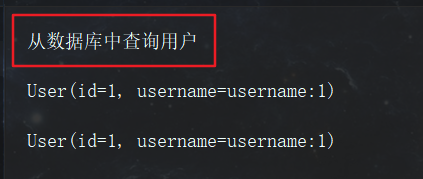
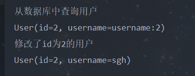
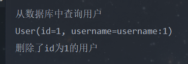
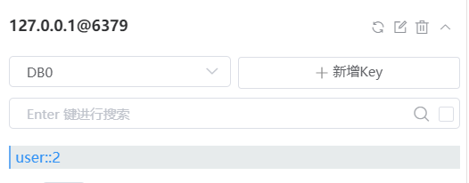

# 前言

缓存现在已经成为了互联网必不可少的利器，合理的利用缓存不仅能大大的提升网站的访问速度，还能够降低数据库的访问压力。接下来介绍如何利用 Redis 来做缓存。

# Redis简介

Redis 是完全开元免费的，遵守BSD协议，是一个高性能的 key-value 数据库。

Redis 与其他 key - value 缓存产品有以下三个特点：

- Redis 支持数据的持久化，可以将内存中的数据保存在磁盘中，重启的时候可以再次加载进行使用。
- Redis 不仅仅支持简单的 key-value 类型的数据，同时还提供 list，set，zset，hash 等数据结构的存储。
- Redis 支持数据的备份，即 master-slave 模式的数据备份。

Redis 的具体教学建议参考菜鸟教程的教程: https://www.runoob.com/redis/redis-tutorial.html

<!--more-->

# SpringBoot整合Redis

## 导入依赖

本文所采用的 SpringBoot 版本为

```xml
<parent>
	<groupId>org.springframework.boot</groupId>
	<artifactId>spring-boot-starter-parent</artifactId>
	<version>2.1.6.RELEASE</version>
	<relativePath/> <!-- lookup parent from repository -->
</parent>
```

Redis 坐标

```xml
<dependency>
	<groupId>org.springframework.boot</groupId>
	<artifactId>spring-boot-starter-data-redis</artifactId>
<dependency>
```

## application.yml 中加入 Redis 的相关配置

```yaml
spring:
  redis:
  	# Redis数据库索引(默认为0) 
    database: 0
    # Redis服务器地址
    host: 127.0.0.1
    # Redis端口
    port: 6379
    # Redis密码(默认为空)
    password:
    jedis:
      pool:
      	# 连接池最大连接数(使用负数表示没有限制) 
        max-active: 8
        # 连接池最大阻塞等待时间(使用负数表示没有限制)
        max-wait: -1
        # 连接池中最大空闲连接
        max-idle: 8
        # 连接池中最小空闲连接
        min-idle: 0
    # 连接超时时间(毫秒)
    timeout: 300
```

我这里是使用的是 jedis 的客户端连接工具。

## 编写RedisConfig

RedisConfig.java

```java
@EnableCaching
@Configuration
public class RedisConfig extends CachingConfigurerSupport {

    /**
     * redisTemplate相关配置
     *
     * @param factory factory
     */
    @Bean
    public RedisTemplate<String, Object> redisTemplate(RedisConnectionFactory factory) {
        RedisTemplate<String, Object> template = new RedisTemplate<>();
        // 配置连接工厂
        template.setConnectionFactory(factory);
        //使用Jackson2JsonRedisSerializer来序列化和反序列化redis的value值（默认使用JDK的序列化方式）
        Jackson2JsonRedisSerializer jacksonSeial = new Jackson2JsonRedisSerializer<>(Object.class);
        ObjectMapper om = new ObjectMapper();
        // 指定要序列化的域，field,get和set,以及修饰符范围，ANY是都有包括private和public
        om.setVisibility(PropertyAccessor.ALL, JsonAutoDetect.Visibility.ANY);
        // 指定序列化输入的类型，类必须是非final修饰的，final修饰的类，比如String,Integer等会跑出异常
        om.enableDefaultTyping(ObjectMapper.DefaultTyping.NON_FINAL);
        jacksonSeial.setObjectMapper(om);
        // 值采用json序列化
        template.setValueSerializer(jacksonSeial);
        //使用StringRedisSerializer来序列化和反序列化redis的key值
        template.setKeySerializer(new StringRedisSerializer());
        // 设置hash key 和value序列化模式
        template.setHashKeySerializer(new StringRedisSerializer());
        template.setHashValueSerializer(jacksonSeial);
        template.afterPropertiesSet();
        return template;
    }

    @Override
    @Bean
    public KeyGenerator keyGenerator() {
        //为给定的方法及其参数生成一个键
        //格式为：com.frog.mvcdemo.controller.FrogTestController-show-[params]
        return (target, method, params) -> {
            StringBuilder sb = new StringBuilder();
            sb.append(target.getClass().getName());//类名
            sb.append(":");
            sb.append(method.getName());//方法名
            sb.append(":");
            for (Object param : params) {
                sb.append(param.toString());//参数
            }
            return sb.toString();
        };
    }

    /**
     * 对hash类型的数据操作
     */
    @Bean
    public HashOperations<String, String, Object> hashOperations(RedisTemplate<String, Object> redisTemplate) {
        return redisTemplate.opsForHash();
    }

    /**
     * 对redis字符串类型数据操作
     */
    @Bean
    public ValueOperations<String, Object> valueOperations(RedisTemplate<String, Object> redisTemplate) {
        return redisTemplate.opsForValue();
    }

    /**
     * 对链表类型的数据操作
     */
    @Bean
    public ListOperations<String, Object> listOperations(RedisTemplate<String, Object> redisTemplate) {
        return redisTemplate.opsForList();
    }

    /**
     * 对无序集合类型的数据操作
     */
    @Bean
    public SetOperations<String, Object> setOperations(RedisTemplate<String, Object> redisTemplate) {
        return redisTemplate.opsForSet();
    }

    /**
     * 对有序集合类型的数据操作
     */
    @Bean
    public ZSetOperations<String, Object> zSetOperations(RedisTemplate<String, Object> redisTemplate) {
        return redisTemplate.opsForZSet();
    }
}
```

## 编写UserService

UserService.java

```java
public interface UserService {

    User findById(Integer id);

    void add(User user);

    User update(User user);

    void deleteById(Integer id);
}
```

## 编写UserServiceImpl

```java
@Service
@CacheConfig(cacheNames = "user")
public class UserServiceImpl implements UserService {

    @Override
    @Cacheable(key = "#p0")
    public User findById(Integer id) {
        System.out.println("从数据库中查询用户");
        User user = new User();
        user.setId(id);
        user.setUsername("username:" + id.toString());
        return user;
    }

    @Override
    @CacheEvict(allEntries = true)
    public void add(User user) {
        System.out.println("增加了id为" + user.getId() + "的用户");
    }

    @Override
    @CachePut(key = "#user.getId()")
    public User update(User user) {
        System.out.println("修改了id为" + user.getId() + "的用户");
        return user;
    }

    @Override
    @CacheEvict(key = "#p0")
    public void deleteById(Integer id) {
        System.out.println("删除了id为" + id + "的用户");
    }
}
```

关于注解 @CacheConfig、@Cacheable、@CacheEvict、@CachePut 的使用参考 [Spring Boot缓存注解@Cacheable、@CacheEvict、@CachePut使用](https://blog.csdn.net/dreamhai/article/details/80642010)

## 编写RedisTest

1. 存入 Redis

```java
@Test
public void test1() {
	User user = userService.findById(1);
	System.out.println(user);
	User user1 = userService.findById(1);
	System.out.println(user1);
}
```

执行结果




可以看出第一次执行的时候是从数据库中查询，第二次就直接从 Redis 缓存中获取数据

也可以利用 Another.Redis.Desktop.Manager 工具看到本地 Redis 存了一个 key 为 user::1 的缓存


2. 修改 Redis

```java
@Test
public void test2() {
	User user = userService.findById(2);
	System.out.println(user);
	user.setUsername("sgh");
	userService.update(user);
	user = userService.findById(2);
	System.out.println(user);
}
```

执行结果



3. 删除 Redis

```java
@Test
public void test3() {
	User user = userService.findById(1);
	System.out.println(user);
	userService.deleteById(1);
}
```

执行结果



然后查看 Redis 工具，可以看到 key 为 user::1 的缓存被删除



详细信息请看项目地址：https://github.com/ShangguanHong/SpringBootDemo/tree/master/Redis