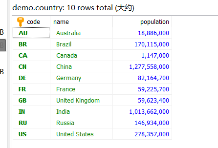
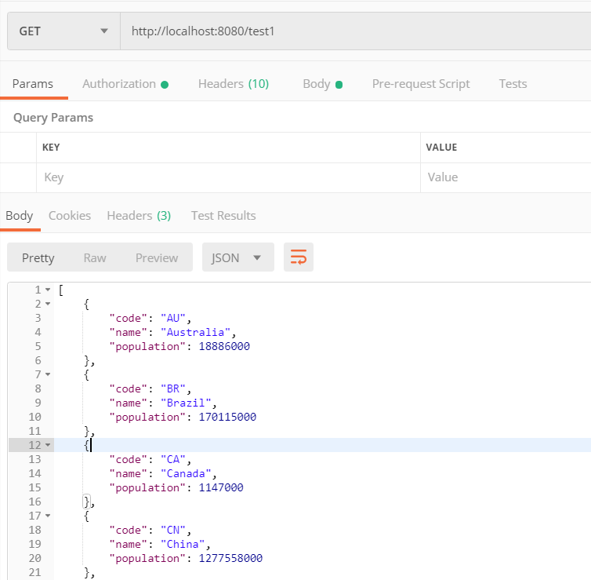

# 前言

之前的文章中写到了如何使用Spring Boot整合mybatis(传送门: [Spring-Boot整合MyBatis](https://shangguanhong.github.io/2019/06/03/Spring-Boot整合MyBatis/))，今天学习一下如何使用Spring Boot整合SpringDataJpa

# Spring Data JPA简介

它是Spring基于ORM框架、JPA规范封装的一套JPA应用框架，可使开发者用极简 
的代码即可实现对数据的访问和操作。它提供了包括增删改查等在内的常用功能， 
且易于扩展！学习并使用Spring Data JPA可以极大的提供开发效率。

<!--more-->

# Spring Boot整合Spring Data Jpa

## 导入依赖

1. SpringDataJpa依赖

```xml
        <dependency>
            <groupId>org.springframework.boot</groupId>
            <artifactId>spring-boot-starter-data-jpa</artifactId>
        </dependency>
```

2. MySQL连接驱动

```xml
        <dependency>
            <groupId>mysql</groupId>
            <artifactId>mysql-connector-java</artifactId>
        </dependency>
```

## 配置文件

```yaml
server:
    port: 8080
    servlet:
        context-path: /
spring:
    datasource:
        driver-class-name: com.mysql.jdbc.Driver
        url: jdbc:mysql://localhost:3306/demo?useUnicode=true&characterEncoding=UTF-8&zeroDateTimeBehavior=convertToNull&allowMultiQueries=true&useSSL=false
        username: root
        password: root
jpa:
    database: MySQL
    database-platform: org.hibernate.dialect.MySQL5InnoDBDialect
    show-sql: true
    hibernate:
        ddl-auto: update
```

> ddl-auto可以有以下几种取值
>
> -  `create`：每次运行程序时，都会重新创建表，这会导致数据丢失
> -  `create-drop`：每次运行程序时会先创建表结构，在程序结束时清空表
> -  `upadte`：每次运行程序，没有表时会创建表，如果对象发生改变会更新表结构，原有数据不会清空，只会更新（推荐使用这种）
> -  `validate`：运行程序会校验数据与数据库的字段类型是否相同，字段不同会报错
> -  `none`: 禁用DDL处理，即什么都不做

## 编写Entity层

Country.java

```java
package com.example.domain;

import lombok.Data;

import javax.persistence.Entity;
import javax.persistence.Id;
import javax.persistence.Table;

@Entity
@Table(name = "country")
@Data
public class Country {
    @Id
    private String code;
    private String name;
    private Integer population;
}
```

>- `@Entity`：表示该类是一个实体类
>
>- `@Table`：对应的数据库中的表
>
>- `@Id`：注解在主键上，一个实体只能有一个@Id注解

## 编写DAO层

CountryRepository.java

``` java
package com.example.repository;

import com.example.domain.Country;
import org.springframework.data.jpa.repository.JpaRepository;
import org.springframework.data.jpa.repository.JpaSpecificationExecutor;
import org.springframework.data.jpa.repository.Query;
import java.io.Serializable;
import java.util.List;

public interface CountryRepository extends JpaRepository<Country, String>, JpaSpecificationExecutor<Country>, Serializable {

    List<Country> queryAll();

    @Query("from Country")
    List<Country> queryAllByMyself();

}


```

> - 创建CountryRepository接口并且继承SpringDataJPA内的接口作为父类，CountryRepository继承了JpaRepository接口（SpringDataJPA提供的简单数据操作接口）、JpaSpecificationExecutor（SpringDataJPA提供的复杂查询接口）、Serializable（序列化接口）。
> - 第一个queryAll()为自带的方法
> - 第二个queryAllByMyself()为自己写的一个方法，实现与上一个一致都是查询country表中的全部数据

## 编写Controller层

CountryController.java

``` java
package com.example.controller;

import com.example.domain.Country;
import com.example.repository.CountryRepository;
import org.springframework.beans.factory.annotation.Autowired;
import org.springframework.web.bind.annotation.GetMapping;
import org.springframework.web.bind.annotation.RestController;

import java.util.List;

@RestController
public class CountryController {

    @Autowired
    CountryRepository countryRepository;

    @GetMapping(value = "/test1")
    public List<Country> test1() {
        List<Country> countries = countryRepository.queryAll();
        return countries;
    }
    @GetMapping(value = "/test2")
    public List<Country> test2() {
        List<Country> countries = countryRepository.queryAllByMyself();
        return countries;
    }
}

```

## 利用postman测试接口

数据库中country表数据为



1. 测试自带的queryAll



2. 测试我们写的queryAllByMyself


可以看到结果一致，表示我们自己写的方法也是成功的，因此一些复杂的sql语句我们就可以自己写，不需要依赖Reposority帮我们实现

# 参考资料

1. [Spring Boot(五)：Spring Boot Jpa 的使用](http://www.ityouknow.com/springboot/2016/08/20/spring-boot-jpa.html)