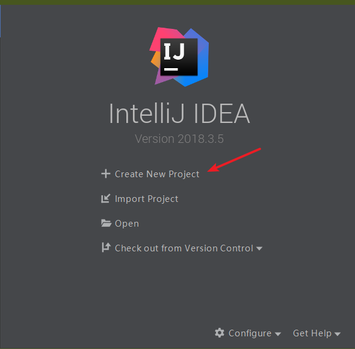
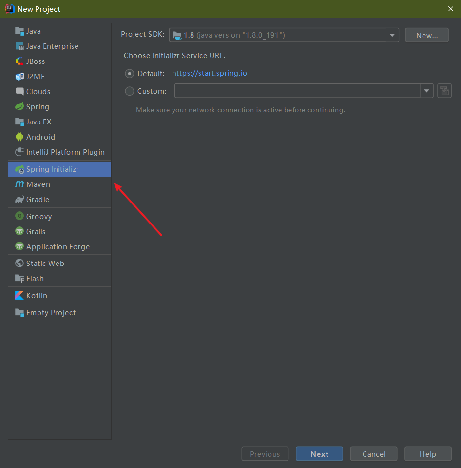
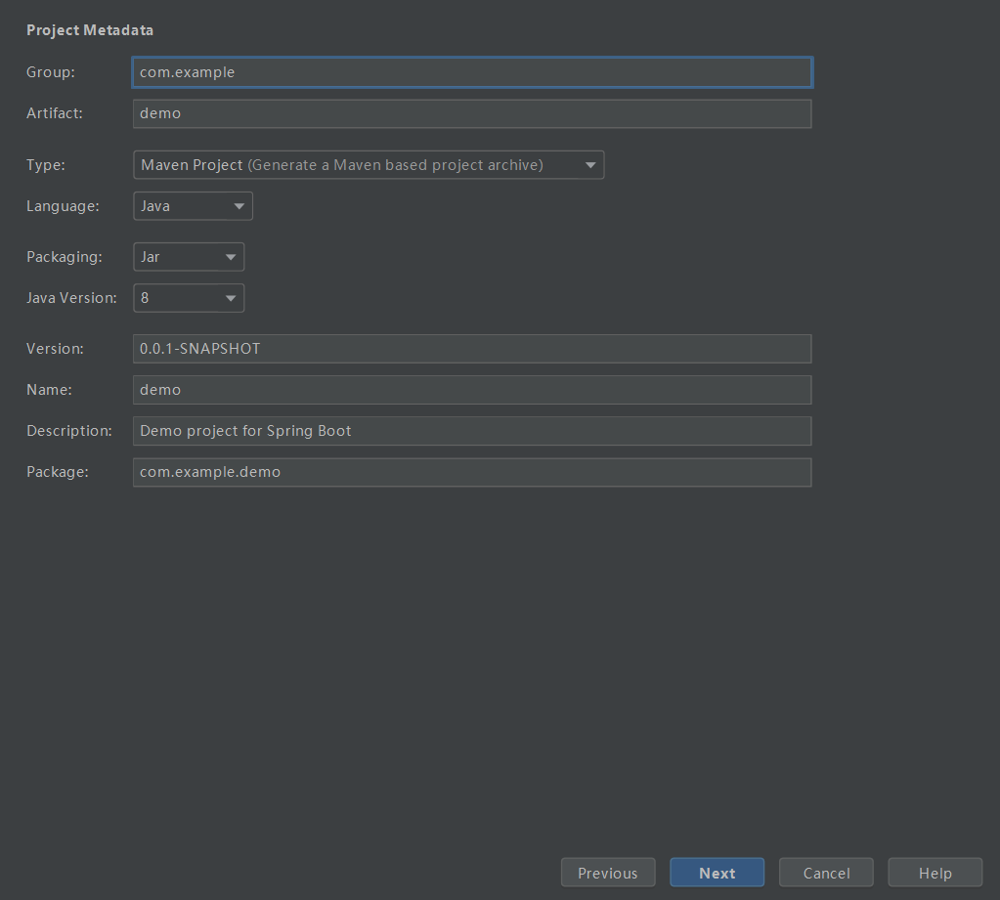
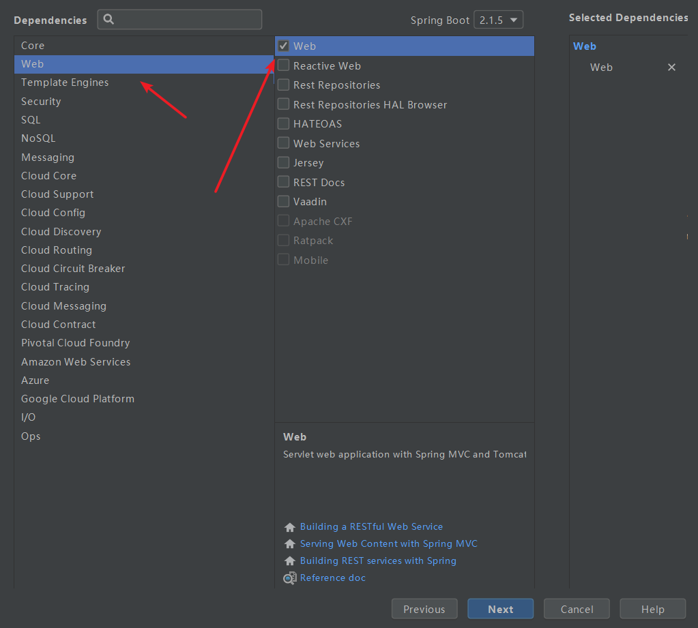
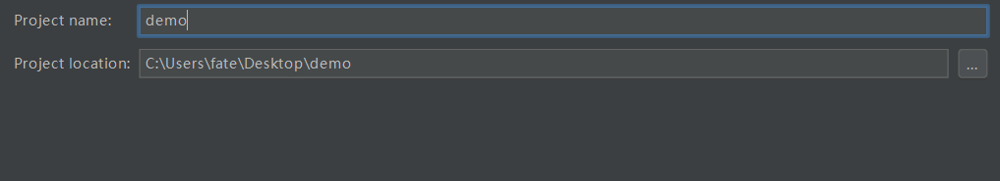
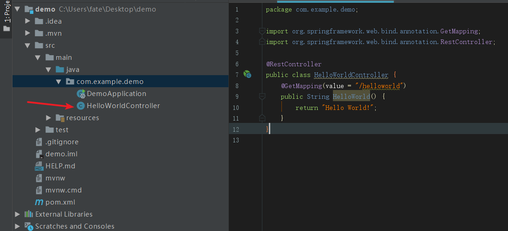
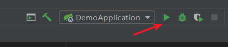

# 1. 前言

Spring Boot是由Pivotal团队提供的全新框架，其设计目的是用来简化新Spring应用的初始搭建以及开发过程。该框架使用了特定的方式来进行配置，从而使开发人员不再需要定义样板化的配置。通过这种方式，Spring Boot致力于在蓬勃发展的快速应用开发领域（rapid application development）成为领导者。

下面进行Spring Boot项目的新建。

> 本机环境: Maven 3.3.9 + JDK1.8 + IDEA

<!--more-->

# 2. 新建Spring Boot项目

1. 点击Create New Project



2. 选择Spring Initializr，点击Next



3. 接下来默认即可，可根据自己需求修改相应内容,点击Next



4. 选择Web，勾选右侧的Web选项，点击Next



5. 选择工程的名称和路径，根据自己需求填写，点击Finish



6. 等待IDEA生成项目文件以及下载依赖与插件，当IDEA最下方没有东西要处理时，表示项目已经成功构建，pom.xml内的文件为

```xml
<?xml version="1.0" encoding="UTF-8"?>
<project xmlns="http://maven.apache.org/POM/4.0.0" xmlns:xsi="http://www.w3.org/2001/XMLSchema-instance"
         xsi:schemaLocation="http://maven.apache.org/POM/4.0.0 http://maven.apache.org/xsd/maven-4.0.0.xsd">
    <modelVersion>4.0.0</modelVersion>
    <parent>
        <groupId>org.springframework.boot</groupId>
        <artifactId>spring-boot-starter-parent</artifactId>
        <version>2.1.5.RELEASE</version>
        <relativePath/> <!-- lookup parent from repository -->
    </parent>
    <groupId>com.example</groupId>
    <artifactId>demo</artifactId>
    <version>0.0.1-SNAPSHOT</version>
    <name>demo</name>
    <description>Demo project for Spring Boot</description>

    <properties>
        <java.version>1.8</java.version>
    </properties>

    <dependencies>
        <dependency>
            <groupId>org.springframework.boot</groupId>
            <artifactId>spring-boot-starter-web</artifactId>
        </dependency>

        <dependency>
            <groupId>org.springframework.boot</groupId>
            <artifactId>spring-boot-starter-test</artifactId>
            <scope>test</scope>
        </dependency>
    </dependencies>

    <build>
        <plugins>
            <plugin>
                <groupId>org.springframework.boot</groupId>
                <artifactId>spring-boot-maven-plugin</artifactId>
            </plugin>
        </plugins>
    </build>

</project>

```

# 3. 运行第一个Spring Boot项目

1. 如下图所示，新建一个HelloWorldController



​	HelloWorldController 内的代码如下

```java
package com.example.demo;

import org.springframework.web.bind.annotation.GetMapping;
import org.springframework.web.bind.annotation.RequestMapping;
import org.springframework.web.bind.annotation.RequestMethod;
import org.springframework.web.bind.annotation.RestController;

/**
 * @Author sgh
 * @Date 2019/5/30 20:30
 * @Description: No Description
 */

@RestController // 这里的@RestController = @ResponseBody + @Controller，可以使每一个方法返回的都是数据而不是页面
// @Controller表示该类内的所有方法默认返回的是页面路径，加了@ResponseBody后返回的是JSON等格式的数据。

public class HelloWorldController {
    @RequestMapping(value = "/helloworld", method = RequestMethod.GET)
    public String HelloWorld() {
        return "Hello World!";
    }
}

```

2. 点击项目右上角Run按钮，开始运行项目



3. 在浏览器输入 localhost:8080/helloworld，可以看到页面显示的Hello World!信息


4. 自此第一个最简单的Spring Boot项目已经搭建成功！.

# 4. 参考资料

1. [SpringBoot入门（IDEA篇）（一）](https://www.cnblogs.com/zmfx/p/8903688.html)
2. [Spring Boot 菜鸟教程 1 HelloWorld](https://www.jianshu.com/p/1e9dcb1d606c)