# 1. 启动Spring Boot项目

1. 第一种方法是使用IDE(集成开发环境)，例如IDEA、Eclipse等，我这里使用的是IDEA，所以我只需点击右上角的Run按钮即可

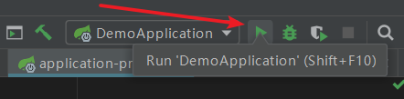

<!--more-->

2. 使用maven命令行启动。在项目根目录下运行 `mvn spring-boot:run`即可

>**注意:使用mvn命令请确保电脑上安装了maven并且配置了maven环境变量，可以输入 `mvn --version` 查看是否 安装（成功安装如下图），若没安装自行百度，按照教程一步一步完成即可**

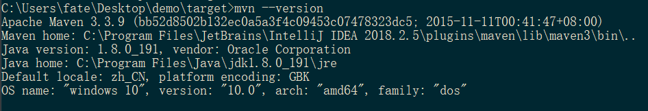

3. 使用jar文件启动。在项目根目录下运行命令 `mvn clean install` (clean表示清空之前编译的文件，install表示打包项目文件成为jar文件)

   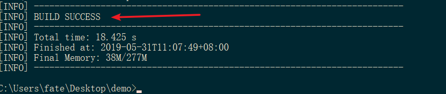

   出现 `BUILD SUCCESS` 表示创建jar成功，之后可以在项目根目录下的target目录下查看到对应的jar文件

   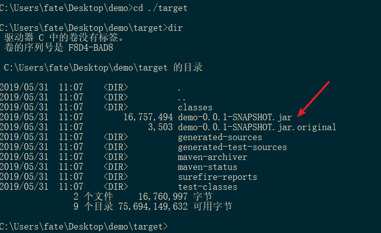

   然后执行 `java -jar demo-0.0.1-SNAPSHOT.jar` 运行该文件即可。

# 2. 编写配置文件

<!--more-->

1. 在项目的该路径下创建这三个文件

   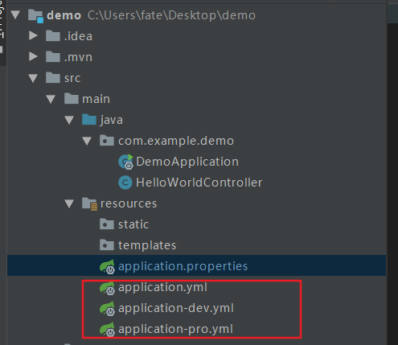

   > application.properties：项目默认提供的配置文件
   >
   > applicatio.yml：yml格式的配置文件，在相同路径下applicatio.yml内的配置优先级高于applicatio.properties
   >
   > application-dev.yml：在开发环境中使用的配置
   >
   > application-pro.yml：在生产环境中使用的配置

   2. application.properties格式为如下

   ```properties
   server.port=8081
   server.servlet.context-path=/demo
   ```

   ​	第一句 `server.port=8081` ，表示修改服务端口号为8081（默认8080）

   ​	第二句 `server.servlet.context-path` ，表示修改了根访问路径为/demo（默认为/），因此我们如果要访问之前的页面 <http://localhost:8080/helloworld> 应该改成 <http://localhost:8081/demo/helloworld>

   3. application.yml格式如下

   ```yml
   server: 
     port: 8081
     servlet: 
       context-path: /demo
   ```

   ​	作用与上述配置文件一致。 **注意：使用yml格式的时候冒号后面需要有空格**

   4. 切换不同的配置文件

      applicatio-dev.yml的内容如下

   ```yml
   server:
     port: 8081
     servlet:
       context-path: /dev
   ```

   ​	application-pro.yml内容如下

   ```yml
   server:
     port: 8082
     servlet:
       context-path: /pro
   ```

   ​	先测试dev环境，修改application.yml内容如下

   ```yml
   spring:
     profiles:
       active: dev
   ```

   ​	运行项目，看到项目输出信息如下

   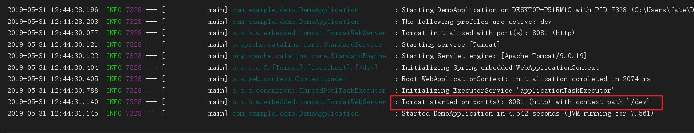

   ​	在浏览器输入 <localhost:8081/dev/helloworld>，可以看到输出了内容

   

   ​	接下来测试pro环境，修改application.yml内容如下

   ```yml
   spring:
     profiles:
       active: pro
   ```

   ​	运行项目，看到项目输出如下信息

   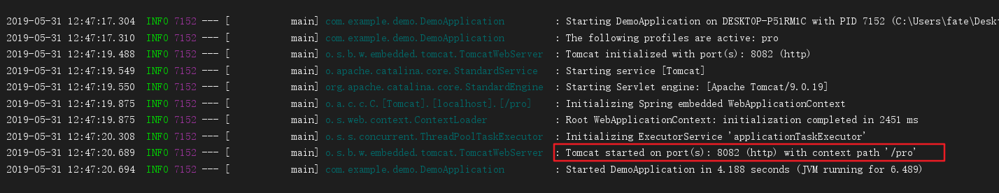

   ​	此时需要在浏览器输入 <localhost:8082/pro/helloworld>，才可以看到内容

   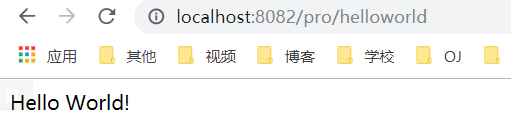

   以上便是最基础的不同环境下切换配置文件的方法

# 3. 在配置文件中定义变量

1. 在application-dev中增加如下字段（以下示例皆在dev环境下）

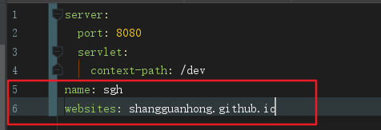

2. 在需要用到的地方使用 `@Value` 注解来拉取数据，如下

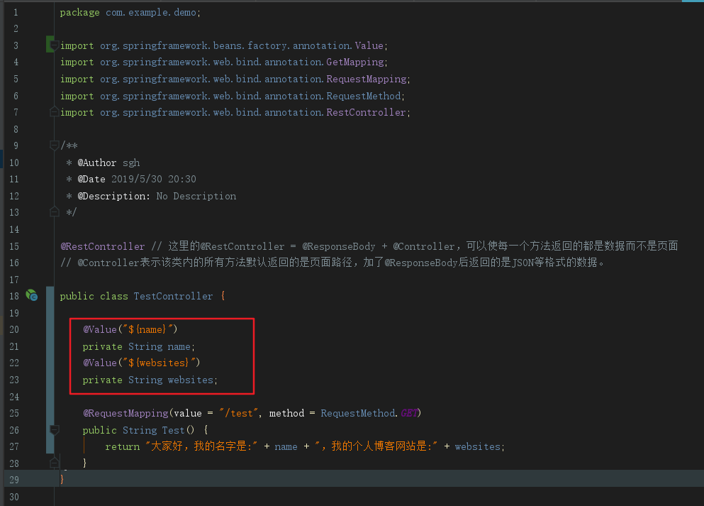

3. 运行程序，浏览器输入 <localhost:8081/dev/test> 可以看到数据拉取成功

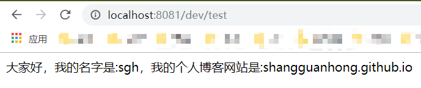

# 4. 配置文件中定义对象

1. 在pom.xml中添加如下依赖，不是红色说明添加依赖成功

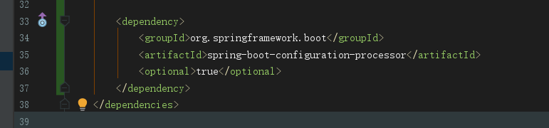

2. 新建一个User POJO，用来测试

```java
package com.example.demo;

import org.springframework.boot.context.properties.ConfigurationProperties;
import org.springframework.stereotype.Component;
import lombok.Data;

/**
 * @Author sgh
 * @Date 2019/5/31 13:25
 * @Description: No Description
 */

@Data // 减少不必要的代码，详情参看 https://blog.csdn.net/qq_37433657/article/details/83275051
@Component // 把普通pojo实例化到spring容器中
@ConfigurationProperties(prefix = "user") // 将配置文件中前缀为user封装成对象

public class User {
    private String username;
    private Integer age;
}
```

3. 在application-dev.yml中添加如下字段

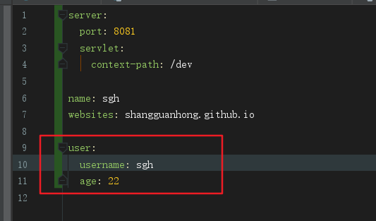

4. 在TestController中新添如下代码

```java
@Autowired // 自动注入
private User user;
@RequestMapping(value = "/test1", method = RequestMethod.GET)
public User Test1() {
    return user;
}
```

5.  浏览器输入<http://localhost:8081/dev/test1> 可以看到对应的数据成功读取

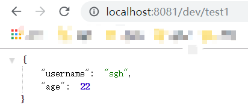

# 5. 参考资料

1. [SpringBoot入门（IDEA篇）（二）](https://www.cnblogs.com/zmfx/p/8906943.html)