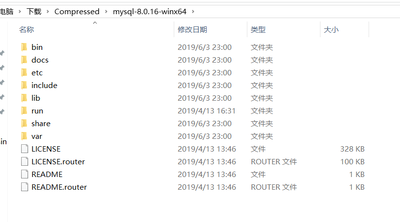

1. 首先去 [MySQL官网](https://dev.mysql.com/downloads/mysql/) ，拉到最底下，下载最新版MySQL安装包


<!--more-->

2. 解压下载的压缩包，内容如下



3. 创建一个my.ini文件，内容如下

```ini
[mysqld]
# 设置3306端口
port=3306
# 设置mysql的安装目录
basedir=C:\phpStudy\PHPTutorial\MySQL
# 设置mysql数据库的数据的存放目录
datadir=C:\phpStudy\PHPTutorial\MySQL\data
# 允许最大连接数
max_connections=200
# 允许连接失败的次数。
max_connect_errors=10
# 服务端使用的字符集默认为utf8mb4
character-set-server=utf8mb4
# 创建新表时将使用的默认存储引擎
default-storage-engine=INNODB
# 默认使用“mysql_native_password”插件认证
#mysql_native_password
default_authentication_plugin=mysql_native_password
[mysql]
# 设置mysql客户端默认字符集
default-character-set=utf8mb4
[client]
# 设置mysql客户端连接服务端时默认使用的端口
port=3306
default-character-set=utf8mb4
```

并且创建一个空的data文件夹

4. 将mysql文件夹的bin目录加入到系统环境变量中


5. **管理员身份运行cmd** ，执行以下代码

```shell
mysqld -install # 如果出现提示已安装过，则先执行 mysqld -remove 再执行 mysqld -install
mysqld --initialize --console # 看到控制台 root@localhost: '密码'，此为mysql初始密码请记住，接下来要用到
```

6. 使用 `net satrt mysql` 启动mysql服务
7. 输入 `mysql -uroot -p密码` 进入mysql，此处密码填刚才控制台出现的密码
8. 修改密码。命令 ` alter user user() identified by 'new password';`
9. 结束！