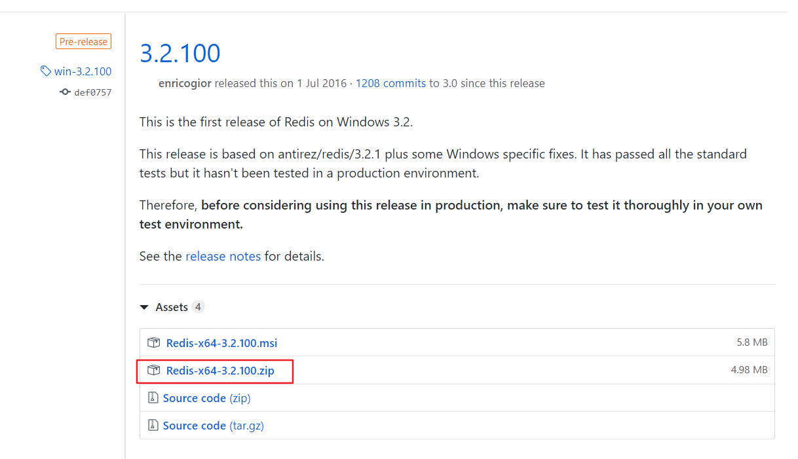
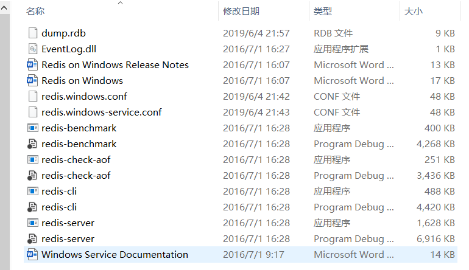
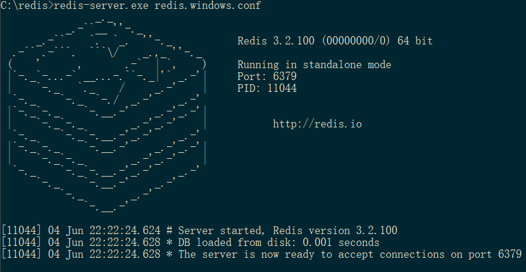
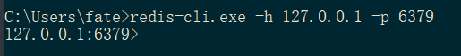
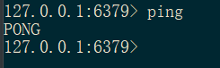
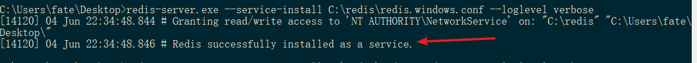
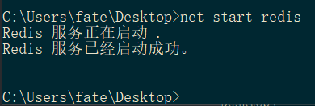
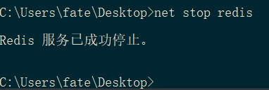
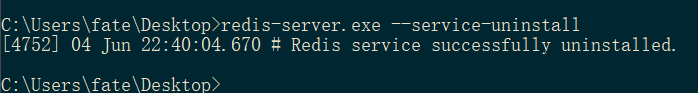

# 下载

**下载地址：**<https://github.com/MSOpenTech/redis/releases>。

Redis 支持 32 位和 64 位。这个需要根据你系统平台的实际情况选择，这里我下载 **Redis-x64-3.2.100.zip**压缩包到 C 盘，解压后，将文件夹重新命名为 **redis**。



打开文件夹，内容如下，其中 `redis-server` 是服务端程序， `redis-cli` 是客户端程序



**建议将redis所在路径加入到系统环境变量中，便于以后操作**

# 运行

打开一个 **cmd** 窗体，使用 `cd` 命令切换到redis目录下，运行

```bash
redis-server.exe redis.windows.conf
```

后面的那个 `redis.windows.conf`  可以省略，如果省略，会启用默认的配置文件 `redis.windows-service.conf` 。输入之后，会显示如下界面：



**这时候另启一个 cmd 窗口，原来的不要关闭，不然就无法访问服务端了。**

切换到 redis 目录下运行:

```sh
redis-cli.exe -h 127.0.0.1 -p 6379
```

显示如下



输入ping如果出现PONG则安装成功



# 设置服务

每次运行Redis的时候都需要 `redis-server.exe redis.windows.conf` 下，cmd还得保持在后台，这样是非常麻烦的。可以将redis加入到windows服务中，这样只要启动redis服务就可以了。

安装redis服务， **cmd** 输入以下命令

```bash
C:\redis\redis-server.exe --service-install C:\redis\redis.windows.conf --loglevel verbose  
```

输入命令后，出现以下界面， 出现 `Redis successfully installed as a service` 表明安装redis服务成功。



之后可以通过 **cmd** （管理员身份运行），输入以下命令开启redis服务

```bash
net start redis
```



输入以下命令停止redis服务

```bash
net stop redis
```



如果你想卸载redis服务，可以输入以下命令卸载




# 参考资料

1. [Redis 安装](https://www.runoob.com/redis/redis-install.html)
2. [window 安装redis服务、卸载redis服务和启动redis服务](https://www.cnblogs.com/guzhanyu/p/8947940.html)