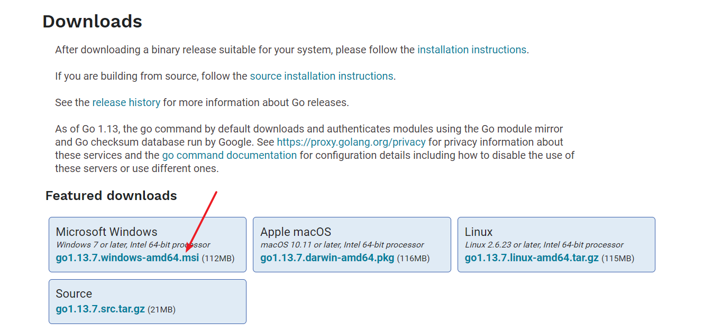
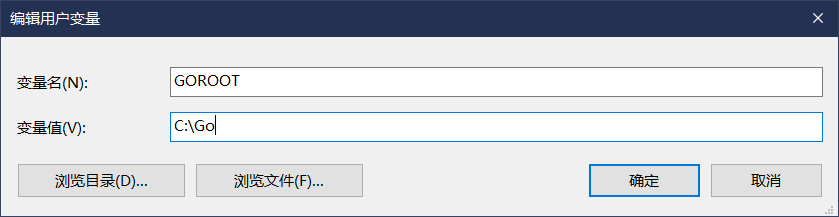
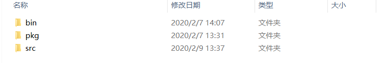
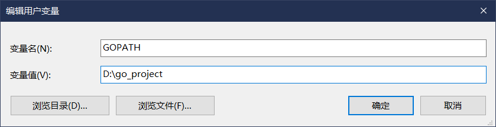
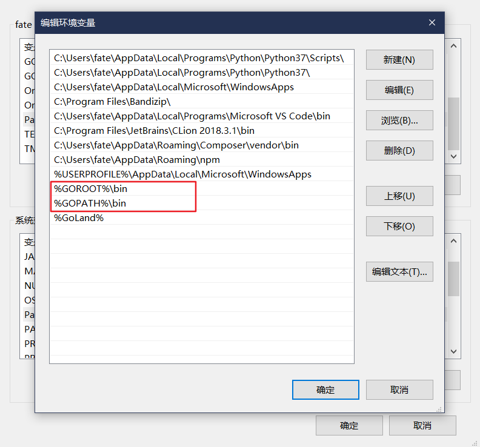
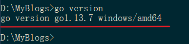
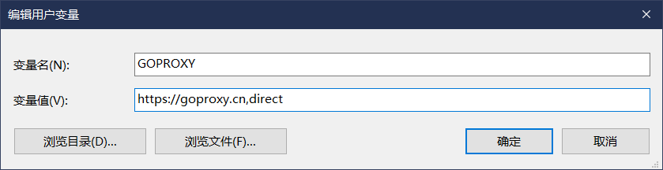
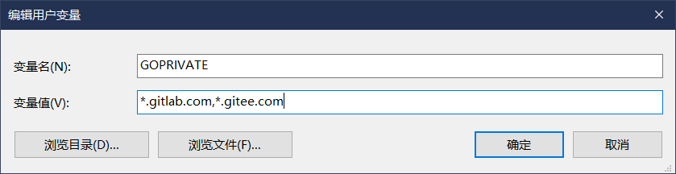
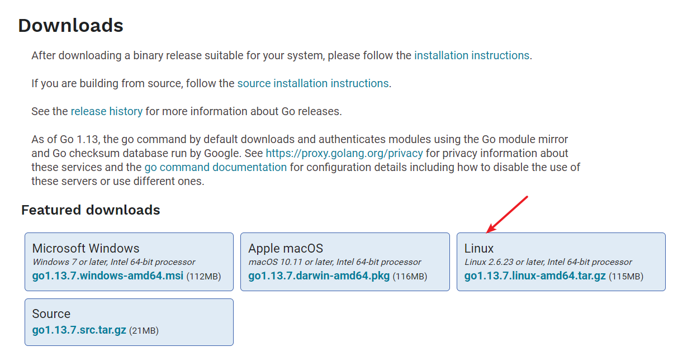

# Windows

1. 去[golang官方下载页面](https://golang.org/dl/)下载最新的安装程序



2. 进行安装，**安装过程中需要记住go的安装目录，默认为 C:\\Go\\** 

3. 增加 `GOROOT` 变量(如果没有的话)，值为第二步的时候 go 的安装目录



4. 增加 `GOPATH` 变量(如果没有的话)，`GOPATH` 是一个我们的工作路径，go 下面的开发都是在该工作路径下进行的，这个工作路径可以是一个随意的目录，但不能是 go 的安装目录，这里我设置为 `D:\go_project`，在该路径下创建三个文件夹，bin、pkg、src。其中bin是存放由go install生成的可执行文件,pkg是存放go编译生成的文件，src是存放是我们的go源代码，不同工程项目的代码以包名区分。





5. 将 `%GOROOT%/bin、%GOPATH%/bin` 加入系统环境变量 PATH 内



6. 打开 cmd，输入 go version，如果出现如下内容说明环境配置成功



7. 我们可以设置 `GOPROXY`来控制go的代理，以及通过`GOPRIVATE`控制私有库不走代理

   

   

8. 如果有的时候我们在运行`go mod vendor`时，提示`Get https://sum.golang.org/lookup/xxxxxx: dial tcp 216.58.200.49:443: i/o timeout`，则是因为Go 1.13设置了默认的`GOSUMDB=sum.golang.org`，这个网站是被墙了的，用于验证包的有效性，可以设置 `GOSUMDB`为`sum.golang.google.cn`， 这个是专门为国内提供的sum 验证服务。

   

9. 可以通过 go env命令查看go的相关环境变量设置

# Linux

1. [golang官方下载页面](https://golang.org/dl/)下载最新的压缩包

   

2. cd到压缩包目录，解压到 `/usr/local/` 目录下，命令为 `sudo tar -C /usr/local/ -zxvf go1.13.7.linux-amd64.tar.gz`

3. 配置环境变量

   ```sh
   # 打开系统配置文件
   $ sudo vim /etc/profile
   # 在/etc/profile文件最下面新增如下配置（GOPATH变量自行设置）
   export GOROOT=/usr/local/go
   export GOPATH=/home/sgh/go_project 
   export GOBIN=$GOPATH/bin
   export PATH=$PATH:$GOROOT/bin
   export PATH=$PATH:$GOPATH/bin
   # 下面的配置自行取舍
   export GOPROXY=https://goproxy.cn,direct
   export GOPRIVATE=*.gitlab.com,*.gitee.com
   export GO111MODULE=on
   export GOSUMDB=org.golang.google.cn
   # 输入go version出现版本信息这说明配置成功
   # 输入go env可以查看go相关的环境变量
   ```

   