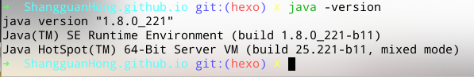

# 前言

之前在朋友的推荐下放弃了以前使用的 Ubuntu，使用了 manjaro 作为我日常使用的 Linux，用了一段时间之后发现这个 Linux 发行版是真的香，以致于我换了电脑之后也想要迅速将 manjaro 安装回来。

manjaro 需要捣鼓的东西还是挺多的，因此为了避免以后重新安装的时候又到处找教程，还不如我将这次用到的东西记录下来，便于以后的查阅。

官方网站：https://www.manjaro.cn/

<!--more-->

# 换源更新

参考：[Linux系统换源](https://shangguanhong.github.io/2019/11/21/linux系统换源/)

更多的 pacman 指令参考这篇文章：[ArchLinux的pacman命令详解](http://www.ha97.com/3459.html)

# 配置 oh-my-zsh

## 切换到 zsh

```sh
# 查看本地的 shell
cat /etc/shells 
# 切换到zsh(重启后生效)
chsh -s /bin/zsh
# 安装 oh-my-zsh 配置文件
# via curl
sh -c "$(curl -fsSL https://raw.githubusercontent.com/robbyrussell/oh-my-zsh/master/tools/install.sh)"
```

## 插件

```sh
# 语法高亮 
git clone https://github.com/zsh-users/zsh-syntax-highlighting.git $ZSH_CUSTOM/plugins/zsh-syntax-highlighting
# 自动补全
git clone https://github.com/zsh-users/zsh-autosuggestions $ZSH_CUSTOM/plugins/zsh-autosuggestions
# 自动跳转 j指令跳转
sudo pacman -S autojump
# 修改配置文件
vim ~/.zshrc
# 在plugins后括号里添加安装的插件名字
# extract 自带的解压缩工具，使用x指令解压全部格式的压缩包
plugins=(
    git
    autojump
    extract
    zsh-syntax-highlighting
    zsh-autosuggestions
)
# 更新配置文件
source ~/.zshrc    
```

# 安装软件

## pacman

```sh
sudo pacman -S 
vim 
google-chrome 
typora 
teamviewer 
visual-studio-code-bin 
intellij-idea-ultimate-edition 
uget 
neofetch
vlc
```

## yay

```sh
yay -S 
wps-office # wps
ttf-wps-fonts # wps字体
netease-cloud-music # 网易云音乐
deepin-com-qq-im # QQ
deepin-com-qq-office # TIM
deepin-wine-wechat # wechat
```

## 安装搜狗输入法

```sh
sudo pacman -S fcitx-sogoupinyin
sudo pacman -S fcitx-im
# 图形化的配置工具
sudo pacman -S fcitx-configtool 
# 打开配置文件
vim ~/.xprofile
# 添加下列语句
export GTK_IM_MODULE=fcitx
export QT_IM_MODULE=fcitx
export XMODIFIERS="@im=fcitx"
```

重启或者注销之后即可使用搜狗输入法

## 配置小飞机

```sh
sudo pacman -S shadowsocks-libev
```

配置文件格式为

```json
{
    "server":"server_ip",
    "server_port":server_port,
	"mode":"tcp_and_udp",
    "local_address": "0.0.0.0",
    "local_port": 1080,
	"password":"password",
	"method":"chacha20-ietf-poly1305",
	"timeout":60
}
```

## 终端代理

```sh
sudo pacman -S proxychains-ng
# 修改配置文件
sudo vim /etc/proxychains.conf
# 修改最后一行 配置代理 我的如下
[ProxyyList]
socks5 127.0.0.1 1080
# 之后就可以在需要用到代理的命令之前加上proxychains来启动代理
# proxychains curl www.google.com
```

## wine

安装

```sh
sudo pacman -S wine wine_gecko wine-mono
```

字体设置

新建一个 reg 文件，名字随意 如 zh.reg，内容如下

```sh
REGEDIT4
[HKEY_LOCAL_MACHINE\Software\Microsoft\Windows NT\CurrentVersion\FontLink\SystemLink]
"Lucida Sans Unicode"="wqy-microhei.ttc"
"Microsoft Sans Serif"="wqy-microhei.ttc"
"Microsoft YaHei"="wqy-microhei.ttc"
"微软雅黑"="wqy-microhei.ttc"
"MS Sans Serif"="wqy-microhei.ttc"
"Tahoma"="wqy-microhei.ttc" 
"Tahoma Bold"="wqy-microhei.ttc"
"SimSun"="wqy-microhei.ttc"
"Arial"="wqy-microhei.ttc"
"Arial Black"="wqy-microhei.ttc"
"宋体"="wqy-microhei.ttc"
"新細明體"="wqy-microhei.ttc"
```

打开注册表编辑器

```sh
wine regedit
```

在注册表编辑器界面选择“注册表"-"导入”，导入 zh.reg 文件。重启电脑，wine 字体就正常了。

## 安装字体

```sh
sudo pacman -S 
wqy-microhei 
wqy-zenhei 
ttf-wps-fonts 
adobe-source-code-pro-fonts 
adobe-source-sans-pro-fonts
adobe-source-serif-pro-fonts
adobe-source-han-sans-cn-fonts
adobe-source-han-serif-cn-fonts
```

## 配置jdk8

```sh
# 安装jdk8
sudo pacman -S jdk8
# 配置环境变量
sudo vim /etc/profile
# 在最后添加
export JAVA_HOME=/usr/lib/jvm/default
export JRE_HOME=${JAVA_HOEM}/jre
export CLASSPATH=.:${JAVA_HOME}/lib:${JRE_HOME}/lib 
# 更新配置文件
source /etc/profile
```

查看是否成功



# 其他问题

## 修改Home下的目录

```sh
vim ~/.config/user-dirs.dirs
```

修改内容如下

```properties
XDG_DESKTOP_DIR="$HOME/Desktop"
XDG_DOWNLOAD_DIR="$HOME/Download"
XDG_TEMPLATES_DIR="$HOME/Templates"
XDG_PUBLICSHARE_DIR="$HOME/Public"
XDG_DOCUMENTS_DIR="$HOME/Documents"
XDG_MUSIC_DIR="$HOME/Music"
XDG_PICTURES_DIR="$HOME/Pictures"
XDG_VIDEOS_DIR="$HOME/Videos"
```

将 Home 目录下的中文文件夹删除

## 解决时间问题

如果是双系统的话，manjaro 时间会比正常时间慢 8 小时

```sh
sudo timedatectl set-local-rtc true
```

然后注销或者重启。

## 解决关机卡死问题

```sh
# 使用vs code打开文件 /boot/grub/grub.cfg(root权限)
sudo code /boot/grub/grub.cfg --user-data-dir     
# 使用find从头开始查找quiet，第一个quiet空格后面加上 uveau.modeset=0
```

**注意**：manjaro 每次更新内核的时候，都会刷新 grub.cfg 文件，因此每次更新内核的时候都需要进行一次此操作

## 开机开启小键盘

```sh
sudo vim /etc/sddm.conf
# general下的Numlock设为on
[General]
Numlock=on
```

