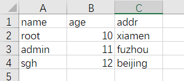
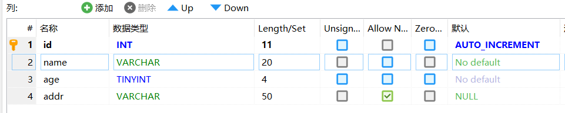
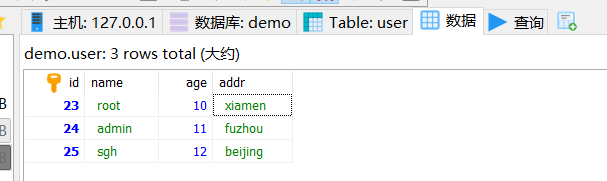

### 1. 前言

POI 是常用的解析 Excel 文件的工具库，Excel 文件有两种格式(.xls和.xlsx)，POI 都支持解析。解析 Excel 文件的流程为读取工作簿(Workbook) → 工作表(Sheet) → 行 (Row)→ 单元格(Cell)。

接下来的实例需要你掌握 `mybatis` 来进行数据库的操作，如果对   `mybatis` 不是很熟悉可以参考 [Spring Boot整合MyBatis](https://shangguanhong.github.io/2019/06/03/Spring-Boot整合MyBatis/) 来进行学习, 以下关于 mybatis 的配置都和上面教程一致。

项目代码: https://github.com/ShangguanHong/SpringBootDemo/tree/master/springboot-poi

<!--more-->

### 2. 前期准备

#### 2.1. excel文件

创建一个测试的 Excel 文件，内容如下



#### 2. 2. user表

建一个 user 表用来存储 excel 文件内的数据，字段如下



#### 2.3. maven 文件

``` xml
<?xml version="1.0" encoding="UTF-8"?>
<project xmlns="http://maven.apache.org/POM/4.0.0" xmlns:xsi="http://www.w3.org/2001/XMLSchema-instance"
         xsi:schemaLocation="http://maven.apache.org/POM/4.0.0 http://maven.apache.org/xsd/maven-4.0.0.xsd">
    <modelVersion>4.0.0</modelVersion>
    <parent>
        <groupId>org.springframework.boot</groupId>
        <artifactId>spring-boot-starter-parent</artifactId>
        <version>2.1.6.RELEASE</version>
        <relativePath/> <!-- lookup parent from repository -->
    </parent>
    <groupId>com.example</groupId>
    <artifactId>springboot_poi</artifactId>
    <version>0.0.1-SNAPSHOT</version>
    <name>springboot_poi</name>
    <description>Demo project for Spring Boot</description>

    <properties>
        <java.version>1.8</java.version>
    </properties>
	<!-- thymeleaf模板依赖 -->
    <dependencies>
        <dependency>
            <groupId>org.springframework.boot</groupId>
            <artifactId>spring-boot-starter-thymeleaf</artifactId>
        </dependency>
        <dependency>
            <groupId>org.springframework.boot</groupId>
            <artifactId>spring-boot-starter-web</artifactId>
        </dependency>
		<!-- lombok依赖 -->
        <dependency>
            <groupId>org.projectlombok</groupId>
            <artifactId>lombok</artifactId>
            <optional>true</optional>
        </dependency>
        <dependency>
            <groupId>org.springframework.boot</groupId>
            <artifactId>spring-boot-starter-test</artifactId>
            <scope>test</scope>
        </dependency>

        <!-- mybatis依赖 -->
        <dependency>
            <groupId>org.mybatis.spring.boot</groupId>
            <artifactId>mybatis-spring-boot-starter</artifactId>
            <version>2.0.0</version>
        </dependency>
        <!-- mysql依赖 -->
        <dependency>
            <groupId>mysql</groupId>
            <artifactId>mysql-connector-java</artifactId>
            <version>5.1.47</version>
        </dependency>
		<!-- POI依赖 -->
        <dependency>
            <groupId>org.apache.poi</groupId>
            <artifactId>poi</artifactId>
            <version>3.16</version>
        </dependency>
        <!-- 解析Excel 2007及以上版本文件必须加上下面的 -->
        <dependency>
            <groupId>org.apache.poi</groupId>
            <artifactId>poi-ooxml</artifactId>
            <version>3.16</version>
        </dependency>

    </dependencies>

    <build>
        <plugins>
            <plugin>
                <groupId>org.springframework.boot</groupId>
                <artifactId>spring-boot-maven-plugin</artifactId>
            </plugin>
        </plugins>
    </build>

</project>

```

#### 2.4. 前端测试页面

在 `src/main/resources/templates/` 路径下，新建一个 HTML 页面，名称为 `uploadexcelfile.html` ，用来上传 excel 文件，内容如下

``` html
<!DOCTYPE html>
<html lang="en" xmlns:th="http://www.thymeleaf.org"
      xmlns:sec="http://www.thymeleaf.org/thymeleaf-extras-springsecurity4">
<head>
    <meta charset="UTF-8"/>
    <title>上传Excel文件</title>
</head>
<body>
<form th:action="@{/excel/upload}" enctype="multipart/form-data" method="post">
    <input type="file" name="file"/>
    <br/>
    <button type="submit">开始导入</button>
</form>
</body>
</html>
```

#### 2.5. Entity层

 `User.java`

``` java
package com.example.domain;

import lombok.Data;

/**
 * @author sgh
 * @date 2019/7/14 15:12
 */
@Data
public class User {
    private Integer id;

    private String name;

    private Byte age;

    private String addr;
}
```

#### 2.6. DAO层

`UserMpper.java`

``` java
package com.example.mapper;
import com.example.domain.User;

/**
 * @author sgh
 * @date 2019/7/14 15:12
 */
@Mapper
public interface UserMapper {
    int insert(User record);
}
```

#### 2.7. XML文件

 `UserMapper.xml`

``` xml
<?xml version="1.0" encoding="UTF-8"?>
<!DOCTYPE mapper PUBLIC "-//mybatis.org//DTD Mapper 3.0//EN" "http://mybatis.org/dtd/mybatis-3-mapper.dtd">
<mapper namespace="com.example.mapper.UserMapper">
  <resultMap id="BaseResultMap" type="com.example.domain.User">
    <!--@mbg.generated-->
    <id column="id" jdbcType="INTEGER" property="id" />
    <result column="name" jdbcType="VARCHAR" property="name" />
    <result column="age" jdbcType="TINYINT" property="age" />
    <result column="addr" jdbcType="VARCHAR" property="addr" />
  </resultMap>
  <insert id="insert" keyColumn="id" keyProperty="id" parameterType="com.example.domain.User" useGeneratedKeys="true">
    insert into user (`name`, age, addr
      )
    values (#{name,jdbcType=VARCHAR}, #{age,jdbcType=TINYINT}, #{addr,jdbcType=VARCHAR}
      )
  </insert>
</mapper>
```

#### 2.8. Util类

 `ExcelUtil.java`  ( **主要操作都在此类，重点理解**)

``` java
package com.example.utils;

import com.example.domain.User;
import lombok.Data;
import org.apache.poi.hssf.usermodel.HSSFWorkbook;
import org.apache.poi.ss.usermodel.*;
import org.apache.poi.xssf.usermodel.XSSFWorkbook;
import org.springframework.web.multipart.MultipartFile;

import java.io.InputStream;
import java.util.ArrayList;
import java.util.List;

/**
 * @author sgh
 * @date 2019/7/14 13:48
 */
@Data
public class ExcelUtil {
    /**
     * 得到excel文件内的用户集合
     *
     * @param mFile 上传的文件
     * @return 用户集合
    */
    public List<User> getExcelInfo(MultipartFile mFile) {
        // 获取文件名
        String fileName = mFile.getOriginalFilename();
        List<User> userList = null;
        try {
            if (!validateExcel(fileName)) {
                return null;
            }
            userList = createExcel(mFile.getInputStream(), fileName);
        } catch (Exception e) {
            e.printStackTrace();
        }
        return userList;
    }

    /**
     * 判断是不是xls后缀的excel文件
     *
     * @param fileName 文件名
     */
    public static Boolean isXlsExcel(String fileName) {
        return fileName.matches("^.+\\.(?i)(xls)$");
    }

    /**
     * 判断是不是xlsx后缀的excel文件
     *
     * @param fileName 文件名
     */
    public static Boolean isXlsxExcel(String fileName) {
        return fileName.matches("^.+\\.(?i)(xlsx)$");
    }

    /**
     * 验证该文件是否为excel文件
     *
     * @param fileName 文件名
    */
    public Boolean validateExcel(String fileName) {
        Boolean isExcelFile = (fileName != null && (isXlsExcel(fileName) || isXlsxExcel(fileName)));
        return isExcelFile;
    }

    /**
     *
     * @param inputStream excel文件输入流
     * @param fileName 文件名
     * @return 用户集合
    */
    public List<User> createExcel(InputStream inputStream, String fileName) {
        List<User> userList = null;
        try {
            Workbook wb = null;
            // 判断类型，使用不同的Workbook
            if (isXlsExcel(fileName)) {
                wb = new HSSFWorkbook(inputStream);
            } else {
                wb = new XSSFWorkbook(inputStream);
            }
            userList = readExcelValue(wb);
        } catch (Exception e) {
            e.printStackTrace();
        }
        return userList;
    }

    /**
     *
     * @param wb 工作薄
     * @return 用户集合
    */
    public List<User> readExcelValue(Workbook wb) {
        List<User> userList = new ArrayList<>();
        // 总行数 总列数
        int totalRows, totalCells = 0;
        // 先得到一个sheet
        Sheet sheet = wb.getSheetAt(0);
        // 得到行数
        totalRows = sheet.getPhysicalNumberOfRows();
        // 得到excel里面的列，前提是有行
        // 大于1是因为我从第二行就是数据了，这个大家看情况而定
        if (totalRows > 1 && sheet.getRow(0) != null) {
            totalCells = sheet.getRow(0).getPhysicalNumberOfCells();
        }
        for (int i = 1; i < totalRows; i++) {
            Row row = sheet.getRow(i);
            if (row == null) {
                continue;//如果行为空的话直接中断
            }
            User user = new User();
            for (int j = 0; j < totalCells; j++) {
                Cell cell = row.getCell(j);
                if (cell != null) {
                    if (j == 0) {
                        // 取姓名
                        user.setName(cell.getStringCellValue());
                    } else if (j == 1) {
                        // 取年龄，先转化为String类型
                        cell.setCellType(CellType.STRING);
                        user.setAge(Byte.parseByte(cell.getStringCellValue()));
                    } else if (j == 2) {
                        // 取地址
                        user.setAddr(cell.getStringCellValue());
                    }
                }
            }
            userList.add(user);
        }
        return userList;
    }
}

```

#### 2.9. Service层与其实现

`ExcelService.java`

```java
package com.example.service;

import org.springframework.web.multipart.MultipartFile;

/**
 * @author sgh
 * @date 2019/7/14 14:35
 */
public interface ExcelService {

    /**
     * 读取excel文件
     *
     * @param file excel文件
     * @return java.lang.Boolean 读取是否成功
    */
    Boolean readExcelFile(MultipartFile file);
}
```

`ExcelServiceImpl.java`

```java
package com.example.service.impl;

import com.example.domain.User;
import com.example.mapper.UserMapper;
import com.example.service.ExcelService;
import com.example.utils.ExcelUtil;
import org.springframework.beans.factory.annotation.Autowired;
import org.springframework.stereotype.Service;
import org.springframework.web.multipart.MultipartFile;

import java.util.List;

/**
 * @author sgh
 * @date 2019/7/14 14:38
 */
@Service
public class ExcelServiceImpl implements ExcelService {

    @Autowired
    private UserMapper userMapper;

    @Override
    public Boolean readExcelFile(MultipartFile file) {
        Boolean result;
        ExcelUtil excel = new ExcelUtil();
        List<User> userList = excel.getExcelInfo(file);
        if (userList != null && !userList.isEmpty()) {
            //不为空的话添加到数据库
            for (User user : userList) {
                userMapper.insert(user);
            }
            result = true;
        } else {
            result = false;
        }
        return result;
    }
}
```

#### 2.10. Controller层

`ExcelController.java`

```java
package com.example.controller;

import com.example.service.ExcelService;
import org.springframework.beans.factory.annotation.Autowired;
import org.springframework.stereotype.Controller;
import org.springframework.web.bind.annotation.RequestMapping;
import org.springframework.web.bind.annotation.RequestMethod;
import org.springframework.web.bind.annotation.RequestParam;
import org.springframework.web.bind.annotation.ResponseBody;
import org.springframework.web.multipart.MultipartFile;

import javax.servlet.http.HttpServletRequest;
import javax.servlet.http.HttpServletResponse;

/**
 * @author sgh
 * @date 2019/7/14 14:43
 */
@Controller
@RequestMapping("/excel")
public class ExcelController {
    @Autowired
    private ExcelService excelService;


    @RequestMapping("/in")
    public String toExcel() {
        return "uploadexcelfile";
    }

    /**
     * 文件上传的方法
     *
     * @param file
     * @param request
     * @param response
     * @return
     */
    @RequestMapping(value = "/upload", method = RequestMethod.POST)
    @ResponseBody
    public String upload(@RequestParam(value = "file") MultipartFile file, HttpServletRequest request, HttpServletResponse response) {
        Boolean result = excelService.readExcelFile(file);
        String message;
        if (result) {
            message = "读取excel文件成功";
        } else {
            message = "读取excel文件失败";
        }
        return message;
    }
}
```

### 3. 测试

打开 `localhost:8080/excel/in` ，选择刚才的测试的 excel 文件


点击开始导入


查看数据库



成功将 excel 文件内的数据导入数据库中

### 4. 参考资料

1. [spring-boot-excelimport将excel数据导入到数据库](https://blog.csdn.net/csdn_12345678910/article/details/81008397)

