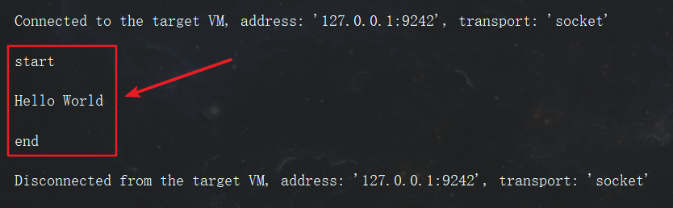
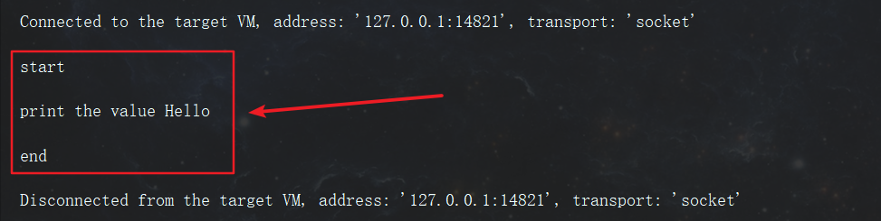

# 1. 前言

最近的项目中遇到了一个问题，我的后台管理系统是使用 Java 语言来开发的，然后有一个模块需要调用使用 Python 写的一个脚本，为此查了许多资料，在这里记录一下。

# 2. 正文

在 java 中调用 python 有两种实现方法，一种是使用 Jython 来调用，但是这个工具在调用第三方模块的时候总是会出现找不到模块的错误，因此我放弃了这种方式，选择了另一种办法--使用 Runtime 来调用 Python 脚本。

使用 Runtime 调用 Python 脚本，并通过流来读取 Python 脚本输出的信息，这种方法着实有点不美观，但是这是目前比较好的一种解决方案。

<!--more-->

## 2.1 无参数调用 Python

python 代码如下

```python
#!/usr/bin/python
# -*- coding: UTF-8 -*-

import sys

def func():
    print("Hello World")

if __name__ == "__main__":
    func()
```

Test.java

```java
import java.io.BufferedReader;
import java.io.InputStreamReader;

public class Test {
    public static void main(String[] args) {
        try {
            System.out.println("start");
            // python指令 记得配好环境变量
            String command = "python";
            // python的路径 可以相对地址
            String path = "C:\\Users\\sgh\\Desktop\\python.py";
            // 参数列表
            String[] argv = new String[]{command, path};
            Process pr = Runtime.getRuntime().exec(argv);
            // 得到 BufferedReader
            BufferedReader in = new BufferedReader(new InputStreamReader(pr.getInputStream()));
            String line;
            while ((line = in.readLine()) != null) {
                System.out.println(line);
            }
            in.close();
            pr.waitFor();
            System.out.println("end");
        } catch (Exception e) {
            e.printStackTrace();
        }

    }
}
```

执行结果如下



## 2.2 传入参数调用 Python

在更多的场景下我们需要通过 Java  程序传入参数给 Python 脚本来执行相应的任务，这也是能实现的。

修改 Python 代码如下

```python
#!/usr/bin/python
# -*- coding: UTF-8 -*-

from sys import argv

def func(value):
    print("print the value %s" %(value))

if __name__ == "__main__":
    value = argv[1]
    func(value)
```

修改 Java 代码如下

```java
import java.io.BufferedReader;
import java.io.InputStreamReader;

public class Test {
    public static void main(String[] args) {
        try {
            System.out.println("start");
            // python指令 记得配好环境变量
            String command = "python";
            // python的路径 可以相对地址
            String path = "C:\\Users\\sgh\\Desktop\\python.py";
            String parms = "Hello";
            // 参数列表
            String[] argv = new String[]{command, path, parms};
            Process pr = Runtime.getRuntime().exec(argv);
            // 得到 BufferedReader
            BufferedReader in = new BufferedReader(new InputStreamReader(pr.getInputStream()));
            String line;
            while ((line = in.readLine()) != null) {
                System.out.println(line);
            }
            in.close();
            pr.waitFor();
            System.out.println("end");
        } catch (Exception e) {
            e.printStackTrace();
        }

    }
}
```

需要传递的参数跟在 argv 数组的后面，然后在 Python 脚本中使用 argv 来读取，注意从下标 1 开始， 0 代表的是 Python 文件的路径。

执行结果

